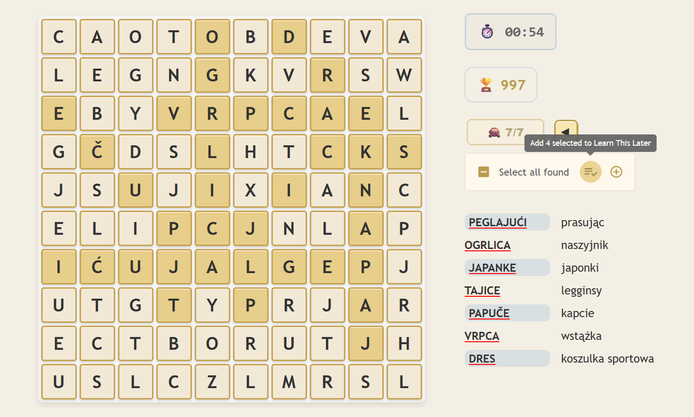
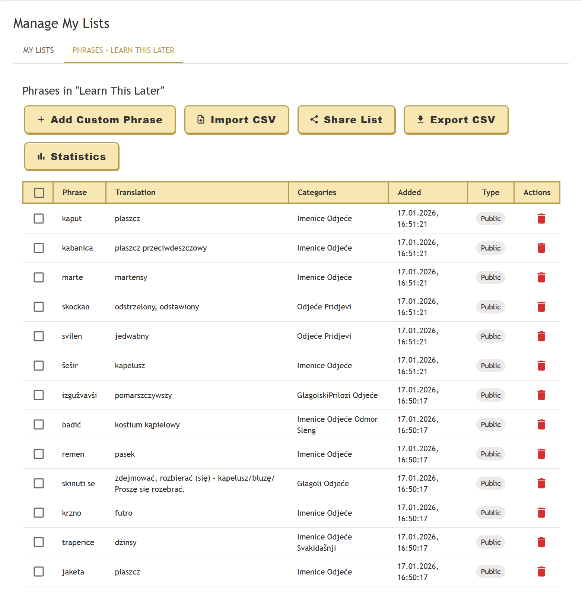
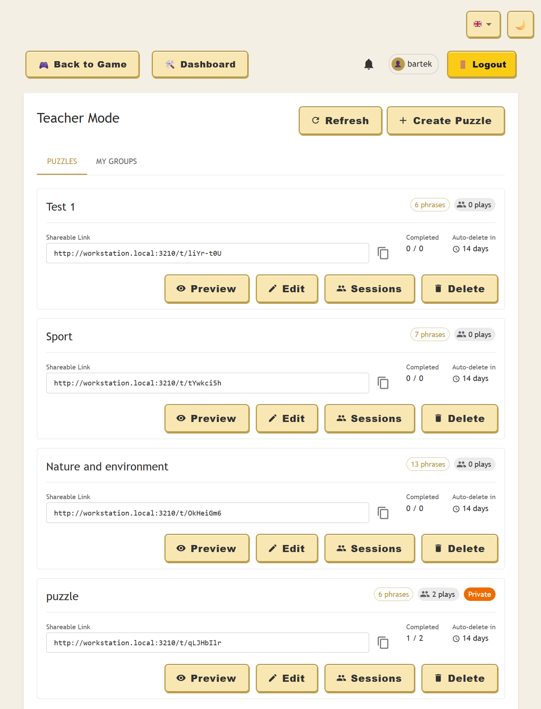
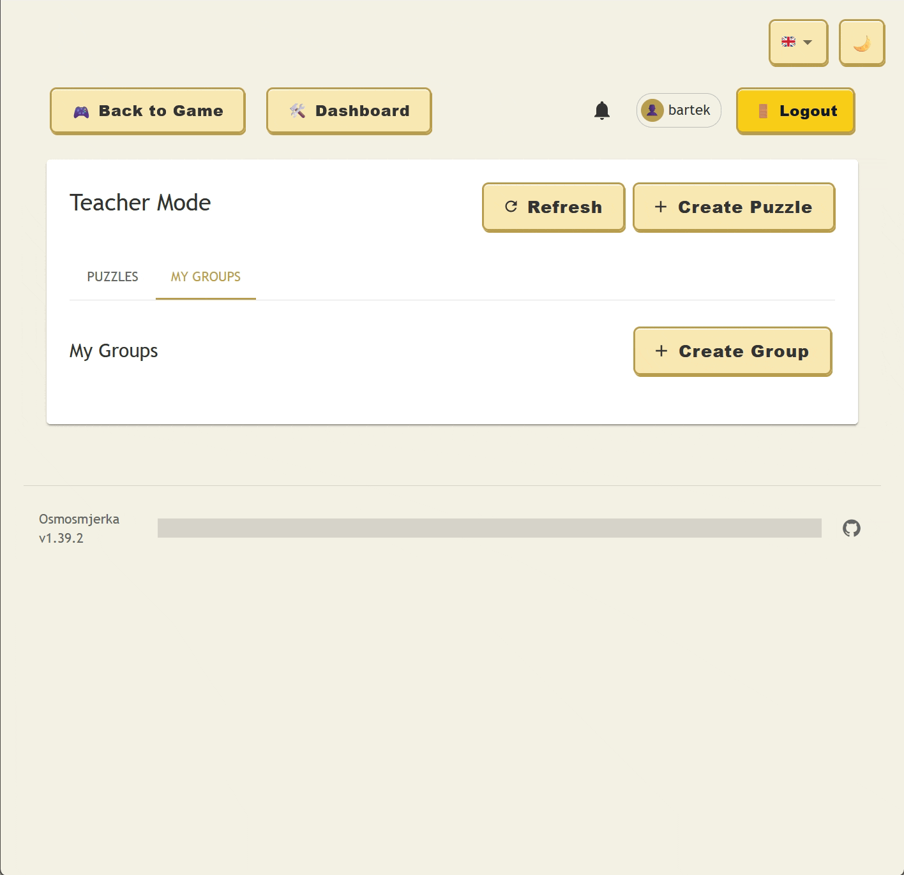
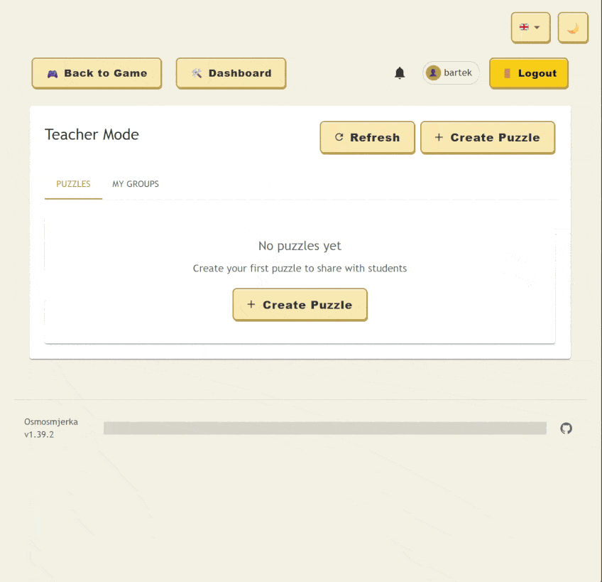
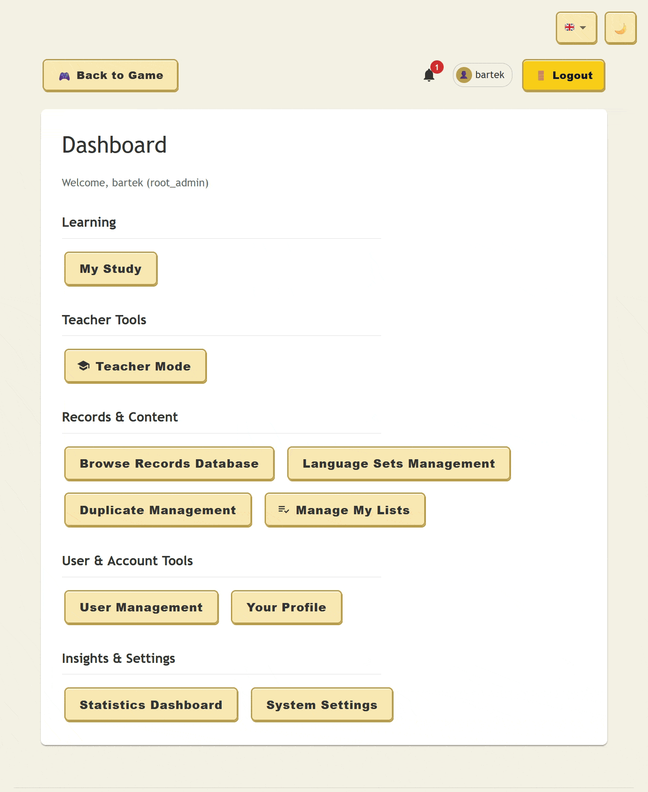
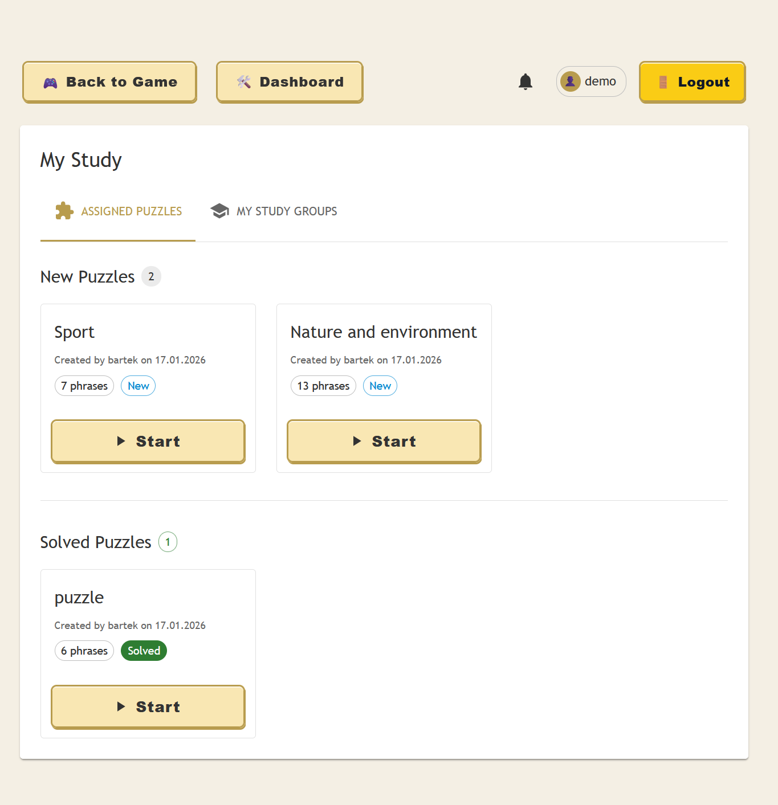
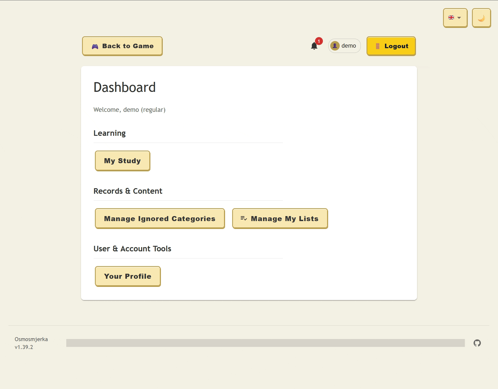

<div align="center">
  
  <h1>Osmosmjerka</h1>
  
  <p>A feature-rich web-based word search game with language learning capabilities</p>
  
  [](LICENSE)
  [](https://github.com/bartekmp/osmosmjerka/actions/workflows/ci-pipeline.yml)
  [](https://react.dev/)
  [](https://fastapi.tiangolo.com/)
  [](https://www.postgresql.org/)
  [](https://github.com/bartekmp/osmosmjerka/pkgs/container/osmosmjerka)
  
  **[🎮 Live Demo](https://osmosmjerka.app/)** • Use `demo` / `demo` to login
  
</div>

---

## 📑 Table of Contents

- [About](#-about)
- [Key Features](#-key-features)
- [How to Play](#-how-to-play)
- [Quick Start](#-quick-start)
  - [Installation](#installation)
  - [Cloud Deployment](#cloud-deployment)
  - [Development Mode](#development-mode)
- [Configuration](#️-configuration)
- [Data Management](#-data-management)
- [Admin Panel](#️-admin-panel)
- [HTTPS Support](#-https-support)
- [Contributing](#-contributing)
- [Roadmap](#️-roadmap)
- [License](#-license)

## 📖 About

[Osmosmjerka](https://hr.wikipedia.org/wiki/Osmosmjerka) (*Croatian for "eight-direction word search puzzle"*) is a modern, multilingual [word search game](https://en.wikipedia.org/wiki/Word_search) designed for language learners. Each puzzle is themed with categorized phrases that include translations, turning gameplay into an engaging [flashcard](https://en.wikipedia.org/wiki/Flashcard)-style learning experience.

**Tech Stack:** React • FastAPI • PostgreSQL

## ✨ Key Features

### Game Features
- 🎯 **Smart Puzzle Generation** - Intelligent algorithm creates challenging grids with maximized phrase intersections ([Algorithm Details](ALGORITHM.md))
- 🌍 **Multi-language Support** - Full i18n with English, Croatian, and Polish (easily extensible)
- 🎨 **Dark/Light Themes** - Comfortable viewing in any lighting condition
- 💾 **Auto-save Progress** - Resume your game exactly where you left off
- 📤 **Export Puzzles** - Download as DOCX or PNG for offline use
- 💡 **Progressive Hints** - Multi-level assistance system when you're stuck
- 📊 **Statistics & Scoring** - Track your performance and improvement over time
- 📱 **Responsive Design** - Optimized for desktop, tablet, and mobile devices

### Admin Features
- 👥 **User Management** - Role-based access control (root admin, admin, user)
- 🗂️ **Language Sets** - Organize phrases into separate language collections
- 📝 **Phrase Database** - Comprehensive management with import/export and duplicate detection
- ⚡ **Batch Operations** - Bulk editing, category management, multi-select actions
- 🔄 **Data Import/Export** - Support for TXT and CSV file formats, plus copy-paste modal for quick additions
- 🔍 **Duplicate Management** - Automatic detection and prevention of duplicate phrases

### Education Features
- 🍎 **Teacher Mode** - Create custom puzzles, manage study groups, and assign work to students
- 📚 **My Study Dashboard** - Students can track pending and completed assignments
- 📈 **Progress Monitoring** - Teachers can view student performance and export results as CSV

## 🎮 How to Play

Find all phrases hidden in the grid! Phrases can appear in eight directions: horizontal, vertical, diagonal, and reversed. Click or swipe to select words, and watch as translations appear when you find them.

### Screenshots

<table>
  <tr>
    <td width="50%">
      <br>
      <em>Finding phrases in action</em>
    </td>
    <td width="50%">
      <br>
      <em>Starting a new puzzle</em>
    </td>
  </tr>
  <tr>
    <td width="50%">
      <br>
      <em>Puzzle completed with visual effects!</em>
    </td>
    <td width="50%">
      <br>
      <em>Dark theme for comfortable viewing</em>
    </td>
  </tr>
</table>

## 🚀 Quick Start

### Prerequisites
- Docker
- PostgreSQL database
- Node.js & npm (for development)

### Installation

1. **Clone the repository**
```bash
git clone https://github.com/bartekmp/osmosmjerka.git
cd osmosmjerka
```

2. **Configure environment**
```bash
cp .env.example .env
# Edit .env with your settings (see Configuration section)
```

3. **Set up PostgreSQL**
   
   Deploy using the [example K8s YAML](/helpers/k8s-postgres.yaml) or use your existing instance. Create the database and user account, then update `POSTGRES_*` variables in `.env`.

4. **Build and run with Docker**
```bash
docker build -t osmosmjerka --build-arg VERSION=v1.33.0 .
docker run --rm -d -p 8085:8085 --name osmosmjerka osmosmjerka
```

5. **Access the application**
   
   Open `http://localhost:8085` in your browser.

### Cloud Deployment

Osmosmjerka is **cloud-ready** and can be deployed in various environments:

#### Standalone Container
Run as a single Docker container on any cloud platform (AWS ECS, Google Cloud Run, Azure Container Instances, etc.):

```bash
docker run -d -p 8085:8085 \
  -e ADMIN_USERNAME=admin \
  -e ADMIN_PASSWORD_HASH=<your_hash> \
  -e ADMIN_SECRET_KEY=<your_secret> \
  -e POSTGRES_HOST=<your_db_host> \
  -e POSTGRES_USER=<db_user> \
  -e POSTGRES_PASSWORD=<db_pass> \
  -e POSTGRES_DATABASE=osmosmjerka \
  osmosmjerka:latest
```

#### Kubernetes Cluster
Deploy to Kubernetes using the provided example manifest:

```bash
# Review and customize the deployment
cp osmosmjerka-deployment.yaml.example osmosmjerka-deployment.yaml
# Edit with your configuration (secrets, resources, etc.)
vim osmosmjerka-deployment.yaml

# Deploy to your cluster
kubectl apply -f osmosmjerka-deployment.yaml
```

The example manifest includes:
- Deployment with configurable replicas
- Service definition
- ConfigMap for environment variables
- Secret management for sensitive data
- Health check probes
- Resource limits and requests

See [`osmosmjerka-deployment.yaml.example`](osmosmjerka-deployment.yaml.example) for the complete configuration template.

### Development Mode

For development with hot reload:

```bash
./start-dev-env-watch.sh
```

This starts:
- Frontend: `http://localhost:3210` (Vite dev server)
- Backend API: `http://localhost:8085`

See [DEVELOPMENT.md](DEVELOPMENT.md) for detailed development setup and workflows.

## ⚙️ Configuration

### Environment Variables

Environment variables are used to configure the application. You can either set them in your shell, use the `.env` file in the root project directory, or when deploying a locally built container use `-e` switches to provide each variable. 

Supported variables:

```bash
# Admin Credentials (required)
ADMIN_USERNAME=admin
ADMIN_PASSWORD_HASH=<bcrypt_hash>  # See below for generation
ADMIN_SECRET_KEY=<your_secret_key>  # Secret key for JWT token signing

# Database (required)
POSTGRES_USER=osmosmjerka
POSTGRES_PASSWORD=<db_password>
POSTGRES_DATABASE=osmosmjerka
POSTGRES_HOST=localhost
POSTGRES_PORT=5432

# Database Connection Pool (optional)
DB_POOL_SIZE=10          # Number of connections to maintain in the pool (default: 10)
DB_MAX_OVERFLOW=5        # Maximum number of connections to create beyond pool_size (default: 5)
DB_POOL_TIMEOUT=30      # Timeout in seconds for getting a connection from the pool (default: 30)

# Logging Configuration (optional)
LOG_DEVELOPMENT_MODE=false  # Enable human-readable logs with colors (default: false)
LOG_LEVEL=INFO              # Logging level: DEBUG, INFO, WARNING, ERROR, CRITICAL (default: INFO)
LOG_COLORS=true             # Enable colored output in development mode (default: true)
```

### Generate Admin Password Hash

Use this command to create a bcrypt password hash:

```bash
python3 -c "import bcrypt; import getpass; pwd=getpass.getpass('Password: ').encode(); print(bcrypt.hashpw(pwd, bcrypt.gensalt()).decode())"
```

## Logging & Monitoring

Osmosmjerka features a comprehensive hybrid logging system optimized for both development and production:

- **Development Mode**: Human-readable plain text logs with color coding
- **Production Mode**: Structured JSON logs for Kubernetes and log aggregation
- **Structured Logging**: All logs include contextual data (user_id, session_id, etc.)
- **Exception Tracking**: Full stack traces with context for all errors
- **stdout/stderr Separation**: INFO/DEBUG to stdout, WARNING/ERROR/CRITICAL to stderr

**Quick Example:**
```bash
# View logs in Kubernetes
kubectl logs deployment/osmosmjerka-backend | jq 'select(.level=="ERROR")'
```

## 📚 Data Management

### Import Phrases

The admin panel provides multiple ways to add phrases to your database:

#### File Upload
Upload phrases using TXT or CSV files via the admin panel (`/admin`):

**Format:** `phrase;translation;categories`

**Example:**
```
PYTHON;Programming language;Technology Programming
ALGORITHM;Step-by-step procedure;Computer Science
GRAMMAR;Language rules;Language Learning
```

#### Copy-Paste Modal
Prefer direct input? Use the copy-paste modal in the admin panel to paste blocks of phrases directly:
- No need to create files first
- Paste multiple lines at once
- Same format as file uploads: `phrase;translation;categories`
- Real-time validation before submission
- Ideal for quick additions or updates

#### Duplicate Management
Osmosmjerka automatically handles duplicates intelligently:
- **Automatic Detection** - Identifies duplicate phrases during import
- **Smart Prevention** - Prevents duplicate entries in the database (phrase field is the primary key)
- **Clear Reporting** - Shows which phrases were skipped due to duplication
- **Safe Imports** - You can re-import the same file without creating duplicates
- **Merge Support** - Update existing phrases by importing with the same phrase text

**Sample Data:** Check the `example/words.txt` file for Croatian-Polish phrases.

### Language Sets

Organize phrases into separate collections (e.g., Croatian-English, Spanish-French). Configure via the admin panel under "Language Sets Management".


## Private Phrase Lists

Organize and manage custom phrase collections for targeted learning with the **Learn This Later** feature.

### Overview

Create private phrase lists to save words and expressions you want to practice later. Each phrase added via the **Learn This Later** button during gameplay is automatically saved to your personal collection for future study. You can also create your own lists and import phrases from external sources. **Learn This Later** is a built-in private list and cannot be removed.

### Features

#### 💾 Learn This Later Button



While playing, save interesting phrases directly from the game grid:
- Click and highlight any found phrase on the phrase list view
- Click the "Add X selected to Learn This Later" button
- Access saved phrases anytime from the "My Lists" tab
- Generate a puzzle using only the phrases from your private list
- Continue playing without interruption

#### 📋 List Management



Create and organize multiple themed collections:
- **Create Lists** - Organize phrases by topic, difficulty, or learning goal
- **Rename Lists** - Update list names as your learning focus evolves
- **Delete Lists** - Remove lists you no longer need (phrases are deleted)
- **Switch Between Lists** - Easily navigate between multiple collections
- **Share Lists** - Share your lists with other users
- **Review Lists** - Review your lists and their contents

#### 📤 Batch Import

Import phrases in bulk from external sources (up to 1000 phrases per import):

**CSV Format:**
```csv
source,translation,context,category
hello,hola,greeting,Basic
goodbye,adiós,farewell,Basic
thank you,gracias,gratitude,Polite
```

**Import Process:**
1. Click the **Import** button in List Management
2. Upload a CSV file with phrases
3. Preview the phrases to be imported
4. Confirm to add all phrases to your selected list

**Notes:**
- Maximum 1000 phrases per import
- Duplicate phrases within the import are automatically removed
- `source` and `translation` fields are required
- `context` and `category` fields are optional

#### 🤝 List Sharing

Collaborate with other learners by sharing phrase lists:

**Share a List:**
1. Open the **Share** dialog from List Management
2. Enter the username of the person you want to share with
3. Choose permission level:
   - **Read** - View phrases only, cannot modify
   - **Write** - View and add/edit/delete phrases
4. Click **Share** to grant access

**View Shared Lists:**
- Lists shared by others appear in the **Shared With Me** section
- Permission level is displayed next to each shared list
- Access shared lists just like your own (within permission limits)

**Unshare a List:**
- Select a list by selecting it in the "My Lists" tab, go to the second tab
- Open the **Share List** dialog
- Click **Remove** next to the user you want to revoke access from
- User immediately loses access to the list

#### 📊 Statistics

Track your learning progress with detailed statistics:

**Per-List Statistics:**
- Total phrase count
- Most frequently used phrases
- Last updated timestamp
- Growth over time

**Global Statistics:**
- Total phrases across all lists
- Most active lists
- Learning velocity metrics
- Category distribution

Access statistics from the **Statistics** button in List Management.

## 🛠️ Admin Panel

Access the admin panel at `/admin` with your configured admin credentials.


### User Roles

- **Root Administrator** - Full system access, user management, system settings
- **Administrative Users** - Database management, no user creation/deletion
- **Regular Users** - Game access only

### Features Overview

#### Phrase Database Management


- **Browse & Search** - Advanced filtering, pagination, and search across phrases/translations
- **Inline Editing** - Edit phrases, translations, and categories directly
- **Batch Operations** - Multi-select for bulk delete and category management
- **File Import** - Support for TXT and CSV formats for uploading phrases into the database
- **Copy-Paste Modal** - Quick phrase addition by pasting blocks of text directly (no files needed)
- **Download** - Download the entire database or just filtered rows as a TXT file
- **Duplicate Detection** - Automatic identification and prevention of duplicate entries
- **Data Validation** - Real-time validation with clear error reporting

#### User Management


*Available to root administrators only*

- Create and manage user accounts
- Role assignment and permissions
- Password reset functionality
- User profile customization

#### Language Sets Management


Organize phrases into separate collections for different language pairs or themes:

- Create multiple language collections (e.g., Croatian-English, Spanish-French)
- Set default ignored categories per language set
- Bulk operations for moving phrases between sets
- Configure default language set for new users
- Export/import entire language sets

#### System Settings


*Root administrators only*

Global configuration for game features:
- **Progressive Hints** - Enable/disable multi-level hint system
- **Scoring System** - Toggle statistics tracking and performance metrics
- **User Overrides** - Allow individual users to override global settings

### Game Features

#### Progressive Hints


A multi-level assistance system that helps players solve challenging puzzles:
- First letter hints reveal starting characters
- Progressive disclosure maintains challenge balance
- Configurable globally or per-user
- Visual feedback in the grid

#### Scoring & Statistics


Track and analyze player performance:
- Completion time and accuracy metrics
- Hint usage patterns
- Category-specific performance
- Game completion rates across difficulty levels

## 🍎 Education & Teacher Mode

Osmosmjerka includes powerful tools for educators to manage classes, create custom assignments, and track student progress.

### For Teachers

*Accessed via the "Teacher Tools" section in the Dashboard.*


_Manage your puzzles, assignments, and class groups in one place_

*   **Custom Puzzle Creation**: Design puzzles tailored to your lesson plan.
    *   **Content Control**: Select specific phrases from your database or entire language categories.
    *   **Game Rules**: Configure difficulty, toggle hints, enable/disable translations, and set timers.
    *   **Auto-Expiration**: Set assignments to automatically expire after a set number of days.

*   **Class Management**: Organize your students using **Study Groups**.
    
    *   **Simple Onboarding**: Create a group and notify students about it. Students are added to your class roster upon acceptance right from their personal dashboard.
    *   **Bulk Assignments**: Assign a puzzle to an entire group with a single click.

*   **Flexible Assignment Options**:
    
    *   **Public Links**: Generate a shareable link that anyone can play without logging in.
    *   **Private Assignments**: Assign puzzles directly to specific students or groups. These appear securely in their personal dashboard.

*   **Progress Tracking**:
    
    *   **Session Monitoring**: View detailed reports on who played your puzzles, their scores, found phrases, and completion times.
    *   **Review Translations**: Teachers can check student translation inputs if manual entry was required.
    *   **Data Export**: Download session data as CSV files for grading and analysis.

### For Students

*Accessed via the "Learning" section in the Dashboard.*


_A clear, organized view of all assigned work_

*   **"My Study" Dashboard**: A dedicated space for all teacher-assigned activities.
    *   **To-Do List**: Assignments are clearly organized into **"New Puzzles"** (Pending) and **"Solved Puzzles"** (Completed).
    *   **Status Indicators**: "New" and "Solved" chips help students prioritize their work.
    *   **Assignment Details**: View the creator's name and assignment date for each puzzle.

* **Study Group Management**: Students review and manage their study groups.


*   **Integrated Learning**: Puzzles assigned by teachers behave just like standard games but the teachers can track progress specific to the assignment and review student's translation inputs.


## 🔒 HTTPS Support

The API server ([uvicorn](https://www.uvicorn.org/)) supports SSL/TLS for secure connections.

### Using SSL Certificates

Store certificates in the `backend` directory and update the Docker `CMD`:

```bash
CMD ["uvicorn", "app:app", "--host", "0.0.0.0", "--port", "443", 
     "--ssl-keyfile=privkey.pem", "--ssl-certfile=fullchain.pem"]
```

### Generate Self-Signed Certificate (Development)

```bash
openssl req -x509 -nodes -days 365 -newkey rsa:2048 \
  -keyout privkey.pem -out fullchain.pem -subj "/CN=localhost"
```

**Note:** Self-signed certificates will trigger browser warnings. For production, use certificates from [Let's Encrypt](https://letsencrypt.org/).

## 🤝 Contributing

Contributions are welcome! Please check out:
- [DEVELOPMENT.md](DEVELOPMENT.md) - Development setup and workflows
- [ALGORITHM.md](ALGORITHM.md) - Grid generation algorithm details

### Adding New Languages

1. Create a new JSON file in `frontend/src/locales/`
2. Translate all entries based on existing language files
3. Register the language in `frontend/src/i18n.js`

## 🗺️ Roadmap

- [ ] Integration with [Anki](https://apps.ankiweb.net/) for spaced repetition learning
- [ ] Learning curve tracking
- [ ] Crosswords puzzles
- [x] Teacher mode - puzzles generated by the teacher to their students
- [x] My Study - play puzzles assigned by teachers, manage your study groups
- [x] Notifications - get notified of new assignments and other events


## 📄 License

Licensed under [Apache License 2.0](LICENSE)

## 🙏 Acknowledgments

- Word search puzzle concept: Traditional [Osmosmjerka](https://hr.wikipedia.org/wiki/Osmosmjerka)
- Example Croatian-Polish phrase database included in `example/` folder

---

<div align="center">
  <p>Made with ❤️ for language learners</p>
  <p>
    <a href="https://github.com/bartekmp/osmosmjerka/issues">Report Bug</a> •
    <a href="https://github.com/bartekmp/osmosmjerka/issues">Request Feature</a>
  </p>
</div>
