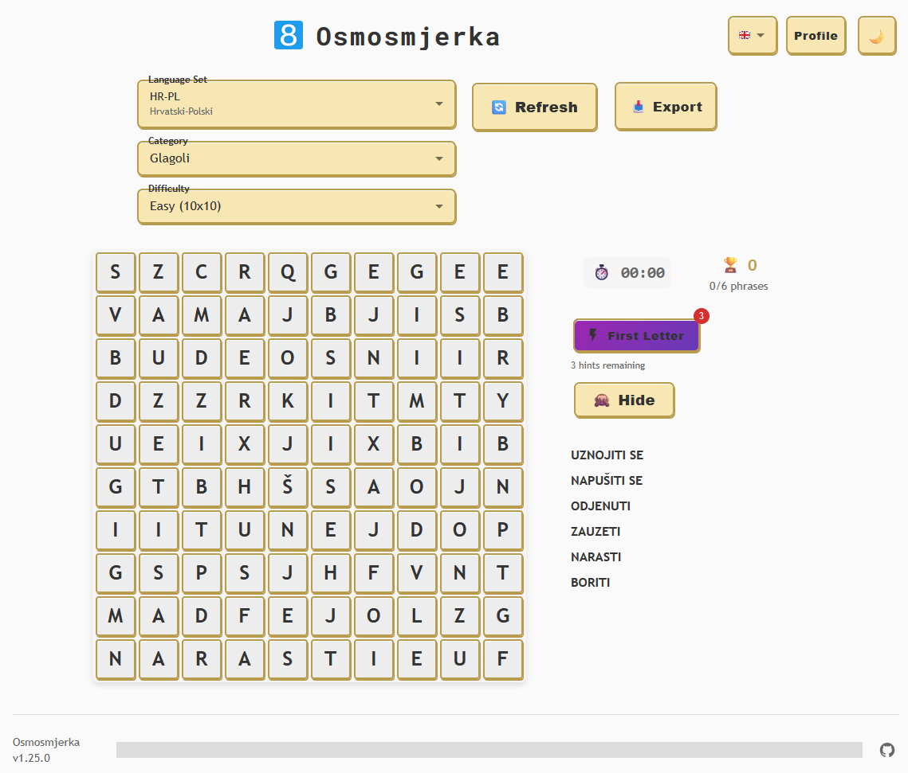
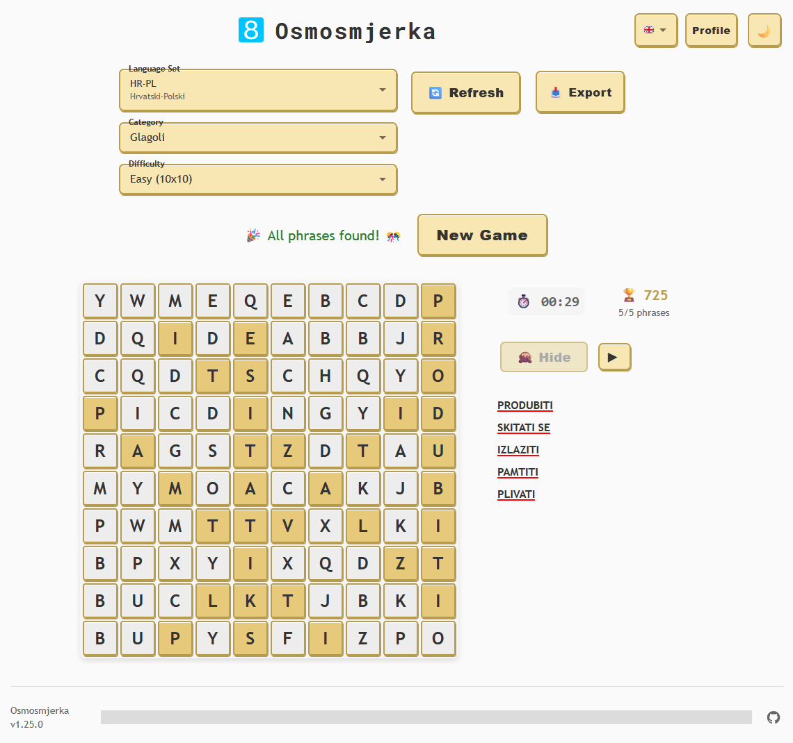
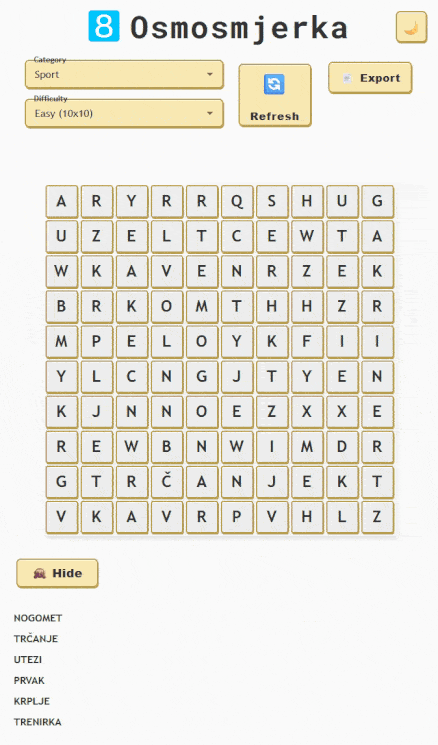
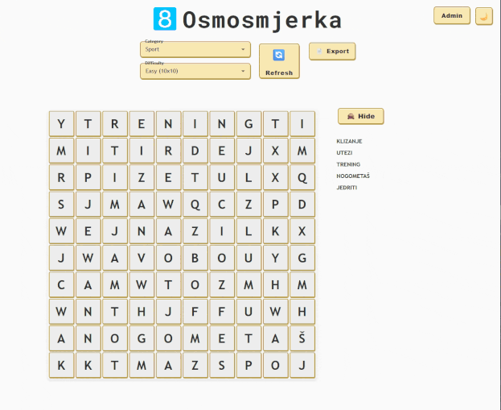
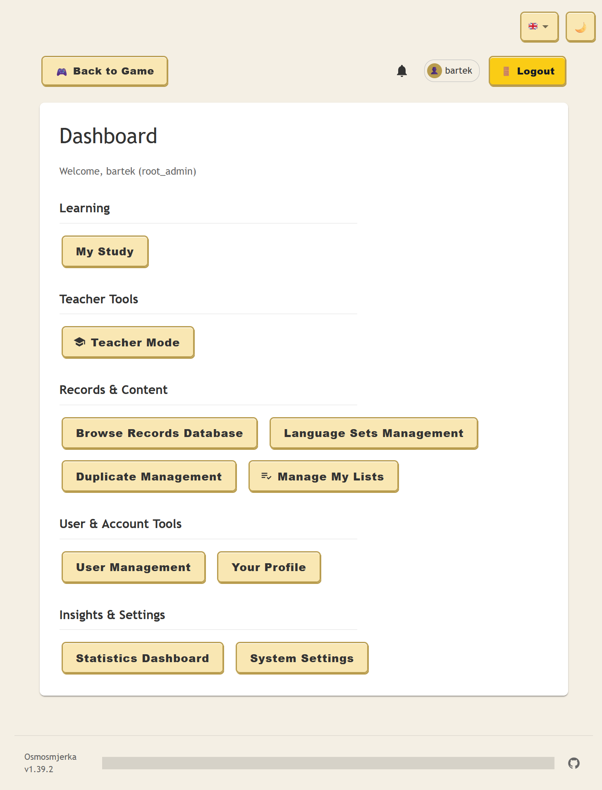

# osmosmjerka
[Osmosmjerka](https://hr.wikipedia.org/wiki/Osmosmjerka) (*Croatian word for eight-direction word search puzzle*) is a feature-rich web-based [word search](https://en.wikipedia.org/wiki/Word_search) game with language learning capabilities.
It uses words from the internal database, which are divided into separate categories, so each puzzle has a certain theme.
Each word includes translation into another language, making it an excellent tool for [flashcard](https://en.wikipedia.org/wiki/Flashcard)-style language training.

**Key Features:**
- **Multi-language Interface**: Complete i18n support with English, Croatian, and Polish translations, easily extendible
- **Dark/Light Mode**: Toggle between themes for comfortable viewing
- **Responsive Design**: Optimized for mobile, tablet, and desktop
- **Game State Persistence**: Automatic progress saving and restoration
- **Administrative Tools**: Comprehensive database management with import/export
- **Touch & Mouse Support**: Seamless interaction across all devices
- **User Management System**: Role-based access control with root admin capabilities


## How it works
Osmosmjerka consists of three layers - a frontend app in [React](https://react.dev/), a [Flask](https://flask.palletsprojects.com/en/stable/)-based HTTP server and a [PostgreSQL](https://www.postgresql.org/) database.
The web app communicates with the server, which pulls data from the database and returns it via HTTP requests to the frontend.
The database so far is expected to have a single table called `words`, which consists of three self-explaining columns `categories`, `word` and `translation`.
You need to provide your own sets of words, either by inserting them directly to the database or use the *Upload Words* functionality on the admin page. The supported file formats are `.txt` and `.csv`, and the expected single-line format is `<categories>;<word>;<translation>`.
The words should have at least 3 characters, since less is going to make the hell of a game to find in a grid, however, the API will filter them out automatically.

## The game
The player needs to find a words shown on the word list in the displayed grid. The words can be found vertically, horizontally, diagonally and with the reversed order of letters.
The puzzle is generated based on the chosen theme and its size (currently there are four levels of difficulty).

The word search grid generation uses an intelligent algorithm that creates challenging puzzles by maximizing word intersections and maintaining directional diversity. For detailed information about the grid generation algorithm, including technical specifications, performance characteristics, and implementation details, see [ALGORITHM.md](ALGORITHM.md).



Once the word is found, there's a neat confetti effect displayed and the translation of the word appears on the word list.
When all words are discovered, the game ends and allows to load a new puzzle.



### Key Features

**Multi-language Interface**
The interface now supports multiple languages with complete internationalization (i18n). Switch between English, Croatian, and Polish using the flag-based language selector in the top-right corner. All text, messages, and error notifications are fully translated, providing a native experience for each language.


**Dark Mode Support**
Toggle between light and dark themes using the moon/sun button. The dark mode provides a comfortable viewing experience in low-light environments with carefully adjusted colors for all UI elements, including loading overlays and error messages.



**User Management System**
A comprehensive user management system with role-based access control:
- **Root Administrator**: Full system access with user creation/deletion capabilities
- **Administrative Users**: Database management with restricted system access
- **Regular Users**: Game access only
- User profiles with customizable descriptions and password management
- Authentication with JWT tokens and bcrypt password hashing

**Game State Persistence**
Your progress is automatically saved and restored when you return to the game. The application remembers your selected category, difficulty, found words, and current puzzle state.

**Interactive Logo**
Click on the Osmosmjerka logo to cycle through different bright colors - a fun easter egg that adds visual variety to the interface.

**Export Functionality**
Export the current puzzle to `.docx`, `.pdf` or `.png` format using the Export button. This allows you to print or share puzzles offline.

**Enhanced Word Finding**
- Click on words in the word list to highlight them briefly in the grid
- Toggle translation visibility with the dedicated button
- Words can be selected in any direction: horizontal, vertical, diagonal, and reversed

**Touch and Mouse Support**
The game works seamlessly on both desktop and mobile devices with optimized touch interactions and responsive design.

## Multi-language Support

Osmosmjerka features complete internationalization (i18n) support with currently three language options: English, Polish and Croatian.
Adding the support for new language is very simple - create a new language JSON file in `frontend/src/locales`, translate all entries based on other language files, and use it in [`frontend/src/i18n.js](frontend/src/i18n.js) file.

All of the user facing texts are translated, including error messages and admin interface labels.

## Responsive Design

Osmosmjerka is built with responsive design principles to provide an optimal experience across all device types and screen sizes.
The responsive design ensures that whether you're playing on a smartphone, tablet, or desktop computer, you'll have an engaging and user-friendly experience tailored to your device.
On mobile screens, some interface elements are reduced to minimum, to keep as much space for the playing area as possible.

## The admin page
The admin page can be accessed via the `/admin` endpoint, which displays a login screen. The system now supports multiple user roles with different access levels:

### User Roles and Authentication
- **Root Administrator**: Created automatically on first startup, has full system access including user management
- **Administrative Users**: Can manage word database but cannot create/delete other users
- **Regular Users**: Game access only (future feature)

The login credentials for the root admin (username and password hash) must be provided via `.env` file (check the `.env.example` file) or the respective env variables before the application is started. Additional users can be created through the user management interface.



The admin panel provides comprehensive database management capabilities:

### Data Management
- **View and Browse**: Display all existing entries with pagination support and category filtering
- **Inline Editing**: Edit entries directly in the table view with immediate validation
- **Bulk Operations**: Add new entries or delete existing ones with confirmation dialogs
- **Database Clearing**: Remove all entries with a safety confirmation prompt

### File Operations
- **Data Import**: Upload new entries from `.txt` and `.csv` files using the format: `<word>;<translation>;<categories>`
- **Data Export**: Export filtered or complete datasets to `.txt` format for backup or external use
- **Duplicate Prevention**: The system automatically prevents duplicate entries based on the word field

### Advanced Features
- **Category Filtering**: Filter the view by specific categories to manage subsets of data
- **Pagination Controls**: Navigate through large datasets with customizable page sizes
- **Responsive Interface**: The admin panel adapts to different screen sizes with optimized layouts for mobile use
- **Search and Navigation**: Quick offset jumping and intuitive pagination controls

### User Management
The admin panel now includes comprehensive user management capabilities, including creating new accounts, role-based access, resetting passwords, editing user information.



The admin interface supports multiple categories per word (separated by spaces), making it easy to organize vocabulary by themes like "Toys Sport Nouns". The word field serves as the primary key, ensuring data integrity by preventing duplicates during imports.

### How to generate admin's password hash
Use this one-liner to convert your password into a hash, which then you can use to log into admin's page:
```bash
python3 -c "import bcrypt; import getpass; pwd=getpass.getpass('Password: ').encode(); print(bcrypt.hashpw(pwd, bcrypt.gensalt()).decode())"
```

## How to run
1. Pull the code and enter the main directory.
2. Create the `.env` file from the template:
```bash
cp .env.example .env
```
3. Set the variables in the `.env` file. 
The `ADMIN_` variables are used as the credentials to the administrator's page (the hash must be made with [bcrypt](https://github.com/pyca/bcrypt) `hashpw` and the secret is any string of your choice). The ignored categories allows you to filter out entries of certain categories from your database you don't want to be used in the game.
4. Deploy your PostgreSQL in K8s using the [example](/helpers/k8s-postgres.yaml) YAML or use your own existing instance. Create the database and user account, then fill the `POSTGRES_` variables in the `.env` file. The table will be created upon the first connection.
5. Build the Docker image using:
```bash
docker build -t osmosmjerka --build-arg VERSION=v1.0.0 .
```
6. Start the app, exposing the `8085` port:
```bash
docker run --rm -d -p 8085:8085 --name osmosmjerka osmosmjerka
```
7. Access the app in your browser at `http://<the host ip>:8085`.

## Example words database
You might use my Croatian-Polish word database as an example placed in the `example` folder. Import it in the admin dashboard using "Upload words" button.

## HTTPS
The API server ([`uvicorn`](https://www.uvicorn.org/)) supports SSL. If you're not using Nginx or other tech, you might continue using `uvicorn` with HTTPS, making use of self-signed certificate or issued by [Let's Encrypt](https://letsencrypt.org/). 
Store them in the `backend` directory and update your command-line:
```bash
uvicorn your_module:app --host 0.0.0.0 --port 443 --ssl-keyfile=<your private key.pem> --ssl-certfile=<your cert chain file.pem>
```
or the `Dockerfile` entrypoint:
```bash
CMD ["uvicorn", "app:app", "--host", "0.0.0.0", "--port", "443", "--ssl-keyfile=<your private key.pem>", "--ssl-certfile=<your cert chain file.pem>"]
```

Now Osmosmjerka is available on `https://<the host ip>`.

### How to generate a self-signed certificate
Use the `openssl` command to create both key and certificate chain files:
```bash
openssl req -x509 -nodes -days 365 -newkey rsa:2048 -keyout privkey.pem -out fullchain.pem -subj "/CN=localhost"
```
As this is self-signed, the browser will show you dreadful warnings when accessing the app.

## Planned features and fixes
- Enhanced visual effects and animations
- Add support for multiple words tables for more than one language
- Integration with [Anki](https://apps.ankiweb.net/)
- API optimization and potential load balancing
- Code quality improvements and testing coverage

# License
Osmosmjerka is licensed under Apache License 2.0.