<div align="center">
  
  <h1>Osmosmjerka</h1>
  
  <p>A feature-rich web-based word search game with language learning capabilities</p>
  
  [](LICENSE)
  [](https://github.com/bartekmp/osmosmjerka/actions/workflows/ci-pipeline.yml)
  [](https://react.dev/)
  [](https://fastapi.tiangolo.com/)
  [](https://www.postgresql.org/)
  [](https://github.com/bartekmp/osmosmjerka/pkgs/container/osmosmjerka)
  
  **[🎮 Live Demo](https://osmosmjerka.lel.lu/)** • Use `demo` / `demo` to login
  
</div>

---

## 📑 Table of Contents

- [About](#-about)
- [Key Features](#-key-features)
- [How to Play](#-how-to-play)
- [Quick Start](#-quick-start)
  - [Installation](#installation)
  - [Cloud Deployment](#cloud-deployment)
  - [Development Mode](#development-mode)
- [Configuration](#️-configuration)
- [Data Management](#-data-management)
- [Admin Panel](#️-admin-panel)
- [HTTPS Support](#-https-support)
- [Contributing](#-contributing)
- [Roadmap](#️-roadmap)
- [License](#-license)

## 📖 About

[Osmosmjerka](https://hr.wikipedia.org/wiki/Osmosmjerka) (*Croatian for "eight-direction word search puzzle"*) is a modern, multilingual [word search game](https://en.wikipedia.org/wiki/Word_search) designed for language learners. Each puzzle is themed with categorized phrases that include translations, turning gameplay into an engaging [flashcard](https://en.wikipedia.org/wiki/Flashcard)-style learning experience.

**Tech Stack:** React • FastAPI • PostgreSQL

## ✨ Key Features

### Game Features
- 🧩 **Two Game Modes** - Classic **Word Search** (find hidden phrases) and **Crossword** (produce the word from its translation clue)
- 🎯 **Smart Puzzle Generation** - Intelligent algorithm creates challenging grids with maximized phrase intersections ([Algorithm Details](ALGORITHM.md))
- 🌍 **Multi-language Support** - Full i18n with English, Croatian, and Polish (easily extensible)
- 🎨 **Dark/Light Themes** - Comfortable viewing in any lighting condition
- 💾 **Auto-save Progress** - Resume your game exactly where you left off
- 📤 **Export Puzzles** - Download word search or crossword puzzles as DOCX or PNG for offline use
- 💡 **Progressive Hints** - Multi-level assistance system when you're stuck
- 📊 **Mastery & Streak Tracking** - Per-word mastery levels and a daily streak track your learning over time
- 🔔 **Notifications** - In-app notifications for assignments and other events
- 📱 **Responsive Design** - Optimized for desktop, tablet, and mobile devices

### Admin Features
- 👥 **User Management** - Role-based access control (root admin, admin, teacher, regular user)
- 🗂️ **Language Sets** - Organize phrases into separate language collections
- 📝 **Phrase Database** - Comprehensive management with import/export and duplicate detection
- ⚡ **Batch Operations** - Bulk editing, category management, multi-select actions
- 🔄 **Data Import/Export** - Support for TXT and CSV file formats, plus copy-paste modal for quick additions
- 🔍 **Duplicate Management** - Automatic detection and merging of duplicate phrases

### Education Features
- 🍎 **Teacher Mode** - Create custom puzzles, manage study groups, and assign work to students
- 📚 **My Study Dashboard** - Students can track pending and completed assignments
- 📈 **Progress Monitoring** - Teachers can view student performance and export results as CSV

## 🎮 How to Play

Osmosmjerka offers two complementary game modes:

- **🔤 Word Search** *(default)* - Find all phrases hidden in the grid! Phrases can appear in eight directions: horizontal, vertical, diagonal, and reversed. Click or swipe to select words, and watch as translations appear when you find them.
- **🧩 Crossword** *(at `/crossword`)* - A production-based mode for deeper learning: instead of spotting words, you read each translation clue and fill in the answer letter by letter, with progressive hints available when you're stuck.

Both modes share categories, difficulty levels, hints, and progress tracking.

### Screenshots

<table>
  <tr>
    <td width="50%">
      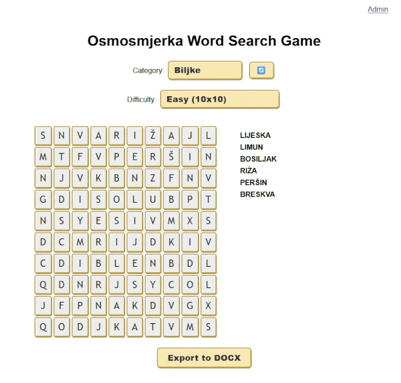<br>
      <em>Finding phrases in action</em>
    </td>
    <td width="50%">
      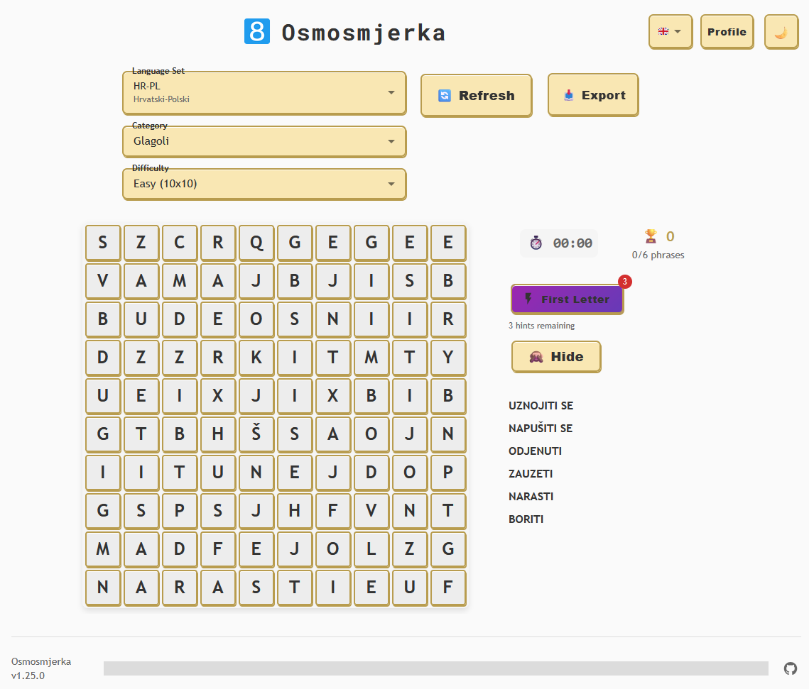<br>
      <em>Starting a new puzzle</em>
    </td>
  </tr>
  <tr>
    <td width="50%">
      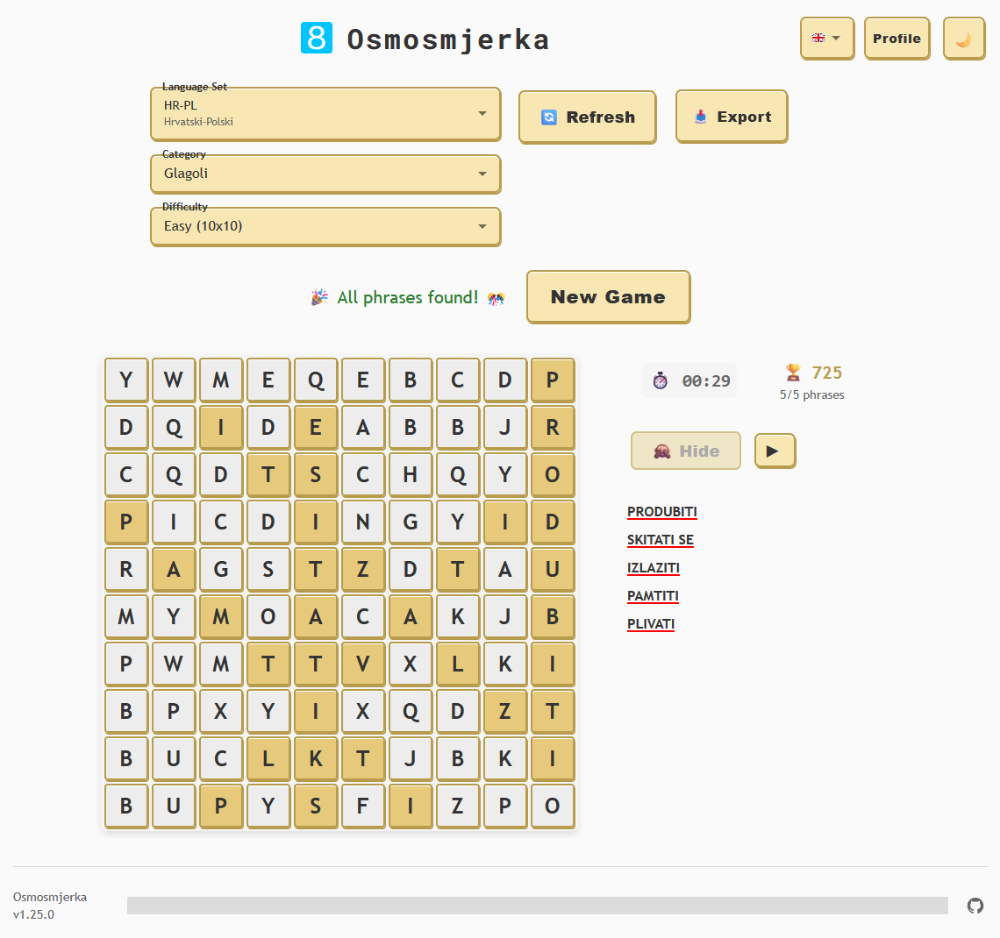<br>
      <em>Puzzle completed with visual effects!</em>
    </td>
    <td width="50%">
      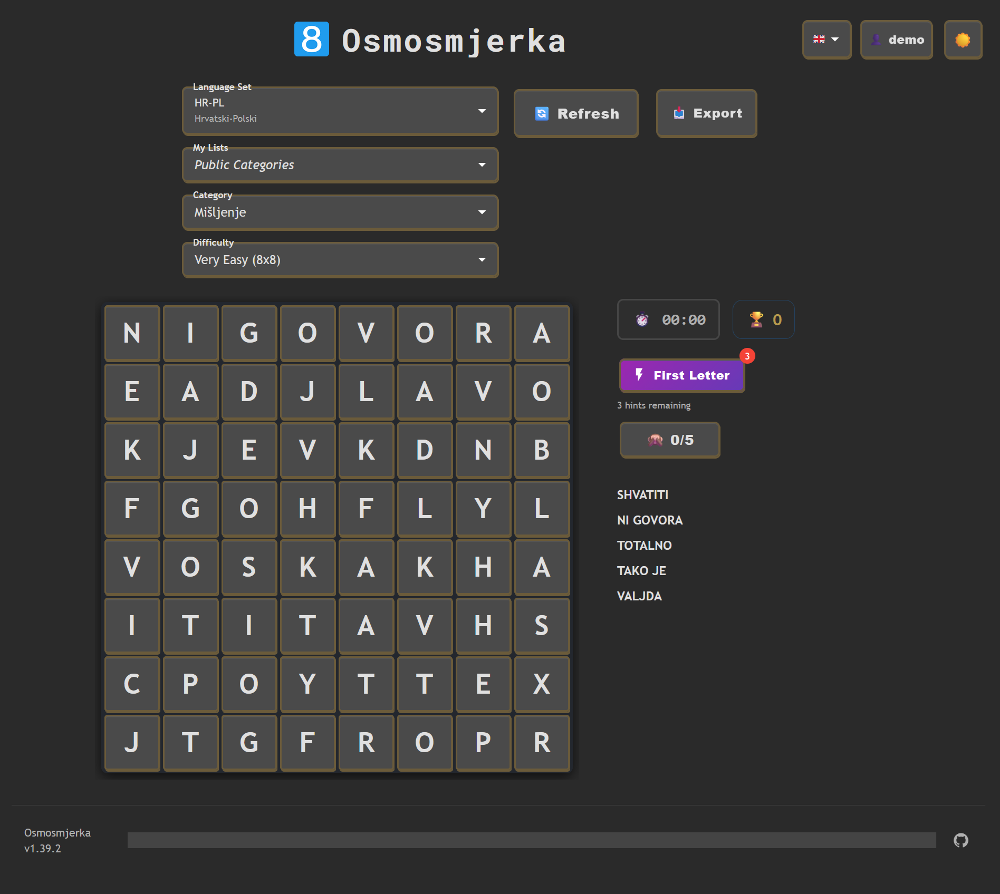<br>
      <em>Dark theme for comfortable viewing</em>
    </td>
  </tr>
  <tr>
    <td width="50%">
      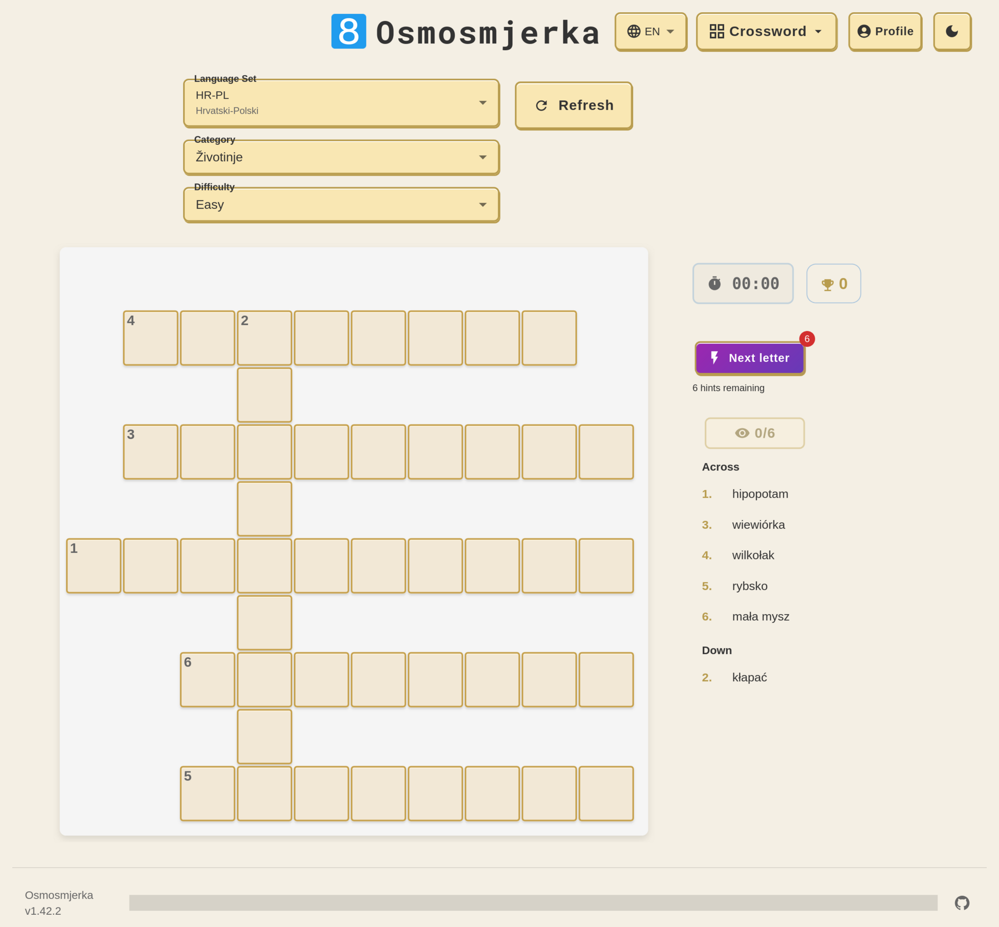<br>
      <em>Crossword mode: read the clue, fill the answer</em>
    </td>
    <td width="50%">
      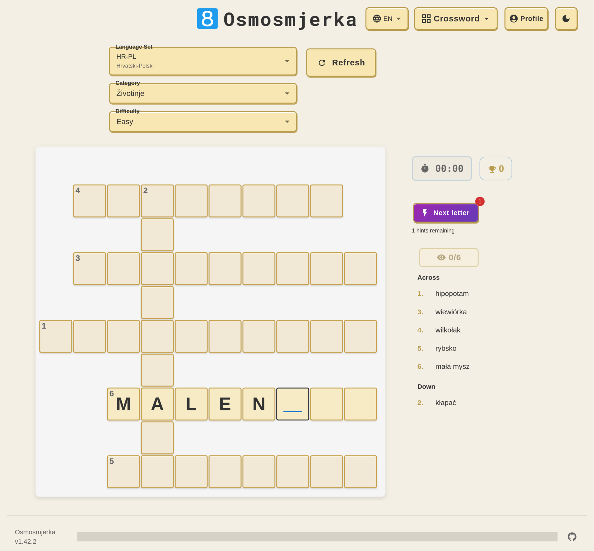<br>
      <em>Filling in answers with progressive hints</em>
    </td>
  </tr>
</table>

## 🚀 Quick Start

### Prerequisites
- Docker
- PostgreSQL database
- Node.js & npm (for development)

### Installation

1. **Clone the repository**
```bash
git clone https://github.com/bartekmp/osmosmjerka.git
cd osmosmjerka
```

2. **Configure environment**
```bash
cp .env.example .env
# Edit .env with your settings (see Configuration section)
```

3. **Set up PostgreSQL**
   
   Deploy using the [example K8s YAML](/helpers/k8s-postgres.yaml) or use your existing instance. Create the database and user account, then update `POSTGRES_*` variables in `.env`.

4. **Build and run with Docker**
```bash
docker build -t osmosmjerka --build-arg VERSION=v1.42.7 .
docker run --rm -d -p 8085:8085 --name osmosmjerka osmosmjerka
```

5. **Access the application**
   
   Open `http://localhost:8085` in your browser.

### Cloud Deployment

Osmosmjerka is **cloud-ready** and can be deployed in various environments:

#### Standalone Container
Run as a single Docker container on any cloud platform (AWS ECS, Google Cloud Run, Azure Container Instances, etc.):

```bash
docker run -d -p 8085:8085 \
  -e ADMIN_USERNAME=admin \
  -e ADMIN_PASSWORD_HASH=<your_hash> \
  -e ADMIN_SECRET_KEY=<your_secret> \
  -e POSTGRES_HOST=<your_db_host> \
  -e POSTGRES_USER=<db_user> \
  -e POSTGRES_PASSWORD=<db_pass> \
  -e POSTGRES_DATABASE=osmosmjerka \
  osmosmjerka:latest
```

#### Kubernetes Cluster
Deploy to Kubernetes using the provided example manifest:

```bash
# Review and customize the deployment
cp osmosmjerka-deployment.yaml.example osmosmjerka-deployment.yaml
# Edit with your configuration (secrets, resources, etc.)
vim osmosmjerka-deployment.yaml

# Deploy to your cluster
kubectl apply -f osmosmjerka-deployment.yaml
```

The example manifest includes:
- Deployment with configurable replicas
- Service definition
- ConfigMap for environment variables
- Secret management for sensitive data
- Health check probes
- Resource limits and requests

See [`osmosmjerka-deployment.yaml.example`](osmosmjerka-deployment.yaml.example) for the complete configuration template.

### Development Mode

For development with hot reload:

```bash
./start-dev-env-watch.sh
```

This starts:
- Frontend: `http://localhost:3210` (Vite dev server)
- Backend API: `http://localhost:8085`

See [DEVELOPMENT.md](DEVELOPMENT.md) for detailed development setup and workflows.

## ⚙️ Configuration

### Environment Variables

Environment variables are used to configure the application. You can either set them in your shell, use the `.env` file in the root project directory, or when deploying a locally built container use `-e` switches to provide each variable. 

Supported variables:

```bash
# Admin Credentials (required)
ADMIN_USERNAME=admin
ADMIN_PASSWORD_HASH=<bcrypt_hash>  # See below for generation
ADMIN_SECRET_KEY=<your_secret_key>  # Secret key for JWT token signing

# Demo Account (optional)
# Creates/refreshes a regular-user demo account on every startup — intended for a
# staging/demo deployment only. Leave both unset (the default) to skip this entirely,
# which is how a production deployment should be configured.
DEMO_USERNAME=demo
DEMO_PASSWORD_HASH=<bcrypt_hash>  # See below for generation

# Database (required)
POSTGRES_USER=osmosmjerka
POSTGRES_PASSWORD=<db_password>
POSTGRES_DATABASE=osmosmjerka
POSTGRES_HOST=localhost
POSTGRES_PORT=5432

# Database Connection Pool (optional)
DB_POOL_SIZE=10          # Number of connections to maintain in the pool (default: 10)
DB_MAX_OVERFLOW=5        # Maximum number of connections to create beyond pool_size (default: 5)
DB_POOL_TIMEOUT=30      # Timeout in seconds for getting a connection from the pool (default: 30)

# Background Maintenance (optional)
# Periodically purges expired notifications, past-auto-delete teacher phrase sets and
# spent account tokens.
MAINTENANCE_INTERVAL_SECONDS=21600  # Seconds between sweeps (default: 21600 = 6h; 0 disables)

# Self-Service Registration (optional)
APP_BASE_URL=https://osmosmjerka.app  # Public base URL used in confirmation/reset links
REGISTRATION_ENABLED=true             # Initial default only - the root admin toggle in
                                      # System Settings overrides it once used

# Outbound Email (optional)
# With SMTP_HOST unset, transactional mail is written to the application log (link
# included) instead of being sent, so local development and the E2E suite work offline.
SMTP_HOST=smtp.example.com
SMTP_PORT=587                  # Defaults to 587, or 465 when SMTP_SECURITY=ssl
SMTP_USERNAME=<smtp_user>      # Omit for an unauthenticated relay
SMTP_PASSWORD=<smtp_password>
SMTP_SECURITY=starttls         # starttls (default) | ssl | none
SMTP_TIMEOUT_SECONDS=15
MAIL_FROM=no-reply@osmosmjerka.app
MAIL_FROM_NAME=Osmosmjerka

# Login Hardening (optional)
MAX_FAILED_LOGINS=10       # Consecutive failures before the account is locked (default: 10)
LOGIN_LOCKOUT_MINUTES=15   # How long the lock lasts (default: 15)
LOGIN_RATE_LIMIT_ATTEMPTS=10        # Sign-in attempts allowed per source IP (default: 10)
LOGIN_RATE_LIMIT_WINDOW_SECONDS=300 # ...within this window (default: 300). Raise it if a
                                    # whole class shares one address; the per-account
                                    # lockout above is what actually stops brute force.
SIGNUP_ATTEMPTS_PER_HOUR=5          # Registrations allowed per source IP per hour
EMAIL_REQUESTS_PER_HOUR=5           # Confirmation resends / reset requests, per IP per hour
TOKEN_REDEMPTIONS_PER_HOUR=20       # Confirmation and reset link redemptions, per IP per hour
MAX_OUTBOUND_EMAILS_PER_HOUR=200    # Hard ceiling on outbound mail (0 = unlimited)
MIN_FORM_FILL_SECONDS=2             # Sign-up submitted faster than this is treated as a bot
FORM_TOKEN_TTL_SECONDS=21600        # How long a rendered sign-up form stays submittable
TRUSTED_PROXY_HOPS=1       # Reverse proxies in front of the app; X-Forwarded-For is read
                           # this many entries from the right so a client-supplied prefix
                           # can't dodge the per-IP rate limits. 0 ignores the header.

# Logging Configuration (optional)
LOG_DEVELOPMENT_MODE=false  # Enable human-readable logs with colors (default: false)
LOG_LEVEL=INFO              # Logging level: DEBUG, INFO, WARNING, ERROR, CRITICAL (default: INFO)
LOG_COLORS=true             # Enable colored output in development mode (default: true)
```

### Accounts and Passwords

Anyone can sign up at `/register` with an email address and a password; the account stays
unusable until the emailed confirmation link is opened. `/forgot-password` sends a
single-use reset link. Both links expire (24 hours for confirmation, 1 hour for a reset),
only their SHA-256 hashes are stored, and the endpoints answer identically whether or not
an address exists, so they can't be used to discover who has an account.

The root admin can close sign-ups from **System Settings → Accounts**; the form then
disappears and the API refuses registrations, leaving the admin panel as the only way to
create an account. `REGISTRATION_ENABLED` supplies the initial value for a deployment that
has never touched the toggle, after which the stored setting wins — so a restart can't
silently reopen sign-ups.

When a confirmation email never arrives (bounced, spam-filtered, SMTP outage), an admin can
confirm an account by hand or re-send its link from **User Management**, where each account
shows its address and whether it is confirmed. A manual confirmation voids any outstanding
link, so an old email can't be replayed.

Passwords are hashed with **Argon2id** (OWASP-recommended parameters) and must be at least
10 characters. Accounts created before Argon2id are still stored as bcrypt; they keep
working and are re-hashed transparently on the next successful login, so no reset is
required.

Signing in accepts either the email address or the display name. Ten consecutive failures
lock an account for 15 minutes (see `MAX_FAILED_LOGINS` / `LOGIN_LOCKOUT_MINUTES`); an
admin password reset clears the lock.

Changing a password ends every session opened with the old one — the point of resetting a
compromised account is to evict whoever else is signed in, and access tokens live an hour.
Disabling an account does the same immediately. Changing your own password re-issues a
token for the tab you did it in, so you aren't signed out by your own action.

### Bot Resistance

The public forms carry two checks instead of a CAPTCHA. A **honeypot field**, hidden from
both the page and the accessibility tree, is something only a script fills in; and a
**signed form token** issued when the page loads forces a would-be flooder to fetch the
form before each submission and lets the server reject one submitted implausibly fast. A
tripped check answers exactly as a real sign-up does, so a bot learns nothing; a form left
open past `FORM_TOKEN_TTL_SECONDS` gets an honest "please reload" instead.

Separately, `MAX_OUTBOUND_EMAILS_PER_HOUR` caps total outbound mail. That is not an
anti-bot measure — it is the circuit breaker for when the rate limits are not enough. Bulk
sign-ups with junk addresses generate bounces, bounces get a sending domain blocklisted, and
a blocklisted domain sends real confirmation emails to spam. Refusing to send is the
recoverable failure.

This deliberately stops short of a CAPTCHA: image challenges are a real accessibility
barrier for an app aimed partly at classrooms, third-party widgets would need holes in the
Content-Security-Policy, and reCAPTCHA in particular ships visitor data off to a third
party. If genuine abuse ever appears, the next step is a self-hosted proof-of-work
challenge, which stays invisible and keeps the data local.

> **Note:** the rate limits and the outbound budget are held in memory, per process. With
> more than one replica the effective ceiling is the configured value times the replica
> count, and every limit resets on deploy. The per-account lockout and the per-account
> email caps live in the database and are unaffected.

### Email Templates

The subject and body of the confirmation and password-reset emails are editable by the root
admin under **System Settings → Email templates**. Bodies are Markdown, rendered to HTML at
send time and delivered as multipart/alternative, so clients that refuse HTML still get a
readable message. Placeholders (`{{name}}`, `{{link}}`, `{{app_name}}`, `{{email}}`,
`{{expiry_hours}}`) are substituted on send; a template is rejected if it uses an unknown
one or omits `{{link}}`. The editor previews the real rendered HTML and can send a test
message — with a sample link, never a usable token. Markdown is deliberate: raw HTML in a
template is escaped rather than passed through, so a template can't inject script into a
recipient's mail client.

### Generate a Password Hash

The root admin and demo accounts are configured by hash, not through the sign-up flow. Use
this command to create a bcrypt password hash (for `ADMIN_PASSWORD_HASH` or
`DEMO_PASSWORD_HASH`) — it is accepted and upgraded to Argon2id where applicable:

```bash
python3 -c "import bcrypt; import getpass; pwd=getpass.getpass('Password: ').encode(); print(bcrypt.hashpw(pwd, bcrypt.gensalt()).decode())"
```

## Logging & Monitoring

Osmosmjerka features a comprehensive hybrid logging system optimized for both development and production:

- **Development Mode**: Human-readable plain text logs with color coding
- **Production Mode**: Structured JSON logs for Kubernetes and log aggregation
- **Structured Logging**: All logs include contextual data (user_id, session_id, etc.)
- **Exception Tracking**: Full stack traces with context for all errors
- **stdout/stderr Separation**: INFO/DEBUG to stdout, WARNING/ERROR/CRITICAL to stderr

**Quick Example:**
```bash
# View logs in Kubernetes
kubectl logs deployment/osmosmjerka-backend | jq 'select(.level=="ERROR")'
```

## 📚 Data Management

### Import Phrases

The admin panel provides multiple ways to add phrases to your database:

#### File Upload
Upload phrases using TXT or CSV files via the admin panel (`/admin`):

**Format:** `categories;phrase;translation` (an optional header line `categories;phrase;translation` is supported; categories are space-separated)

**Example:**
```
Technology Programming;PYTHON;Programming language
Computer Science;ALGORITHM;Step-by-step procedure
Language Learning;GRAMMAR;Language rules
```

#### Copy-Paste Modal
Prefer direct input? Use the copy-paste modal in the admin panel to paste blocks of phrases directly:
- No need to create files first
- Paste multiple lines at once
- Same format as file uploads: `categories;phrase;translation`
- Real-time validation before submission
- Ideal for quick additions or updates

#### Duplicate Management
Osmosmjerka provides tools to find and resolve duplicate phrases:
- **Automatic Detection** - Identifies duplicate phrases within a language set by phrase text (case-insensitive)
- **Grouped Reporting** - Shows duplicate groups and how many copies of each phrase exist
- **Merge & Resolve** - Merge a duplicate group's categories into one kept phrase and delete the rest, from the Duplicate Management panel

**Sample Data:** Check the `example/words.txt` file for Croatian-Polish phrases.

### Language Sets

Organize phrases into separate collections (e.g., Croatian-English, Spanish-French). Configure via the admin panel under "Language Sets Management".

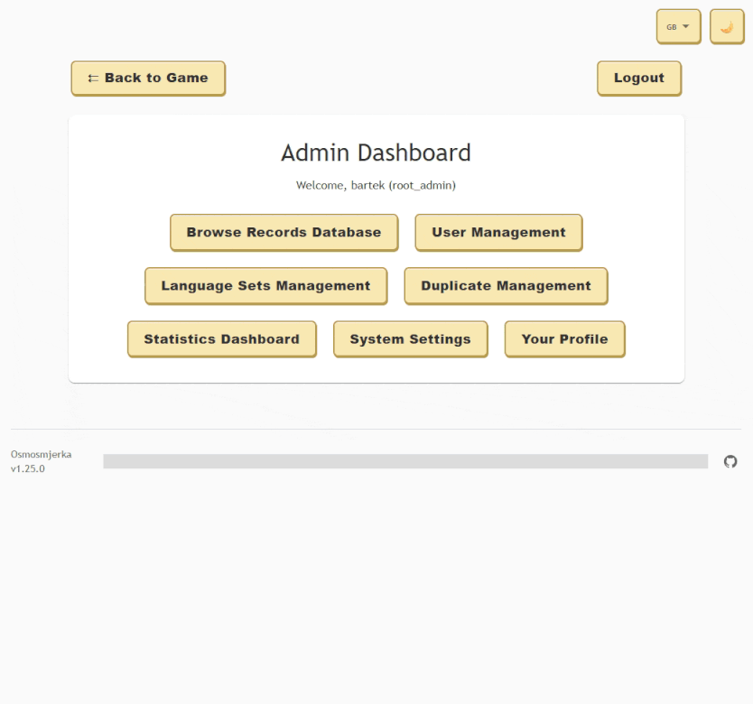

## Private Phrase Lists

Organize and manage custom phrase collections for targeted learning with the **Learn This Later** feature.

### Overview

Create private phrase lists to save words and expressions you want to practice later. Each phrase added via the **Learn This Later** button during gameplay is automatically saved to your personal collection for future study. You can also create your own lists and import phrases from external sources. **Learn This Later** is a built-in private list and cannot be removed.

### Features

#### 💾 Learn This Later Button

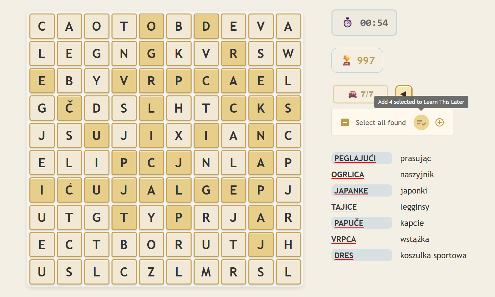

While playing, save interesting phrases directly from the game grid:
- Click and highlight any found phrase on the phrase list view
- Click the "Add X selected to Learn This Later" button
- Access saved phrases anytime from the "My Lists" tab
- Generate a puzzle using only the phrases from your private list
- Continue playing without interruption

#### 📋 List Management

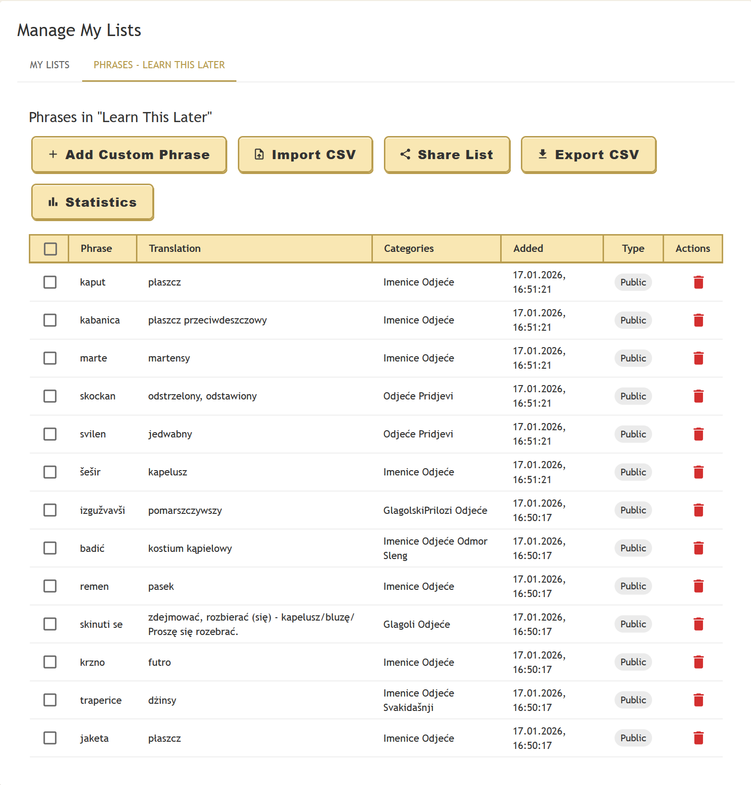

Create and organize multiple themed collections:
- **Create Lists** - Organize phrases by topic, difficulty, or learning goal
- **Rename Lists** - Update list names as your learning focus evolves
- **Delete Lists** - Remove lists you no longer need (phrases are deleted)
- **Switch Between Lists** - Easily navigate between multiple collections
- **Share Lists** - Share your lists with other users
- **Review Lists** - Review your lists and their contents

#### 📤 Batch Import

Import phrases in bulk from external sources (up to 1000 phrases per import):

**CSV Format:** semicolon-separated with a header row (`categories` optional):
```csv
phrase;translation;categories
hello;hola;Greetings
goodbye;adiós;Greetings
thank you;gracias;Polite
```

**Import Process:**
1. Click the **Import** button in List Management
2. Upload a CSV file with phrases
3. Preview the phrases to be imported
4. Confirm to add all phrases to your selected list

**Notes:**
- Maximum 1000 phrases per import
- A header row (`phrase;translation;categories`) defines the columns
- `phrase` and `translation` are required; `categories` is optional

#### 🤝 List Sharing

Collaborate with other learners by sharing phrase lists:

**Share a List:**
1. Open the **Share** dialog from List Management
2. Enter the username of the person you want to share with
3. Choose permission level:
   - **Read** - View phrases only, cannot modify
   - **Write** - View and add/edit/delete phrases
4. Click **Share** to grant access

**View Shared Lists:**
- Lists shared by others appear in the **Shared With Me** section
- Permission level is displayed next to each shared list
- Access shared lists just like your own (within permission limits)

**Unshare a List:**
- Select a list by selecting it in the "My Lists" tab, go to the second tab
- Open the **Share List** dialog
- Click **Remove** next to the user you want to revoke access from
- User immediately loses access to the list

#### 📊 Statistics

Track your learning progress with detailed statistics:

**Per-List Statistics:**
- Total phrase count
- Most frequently used phrases
- Last updated timestamp
- Growth over time

**Global Statistics:**
- Total phrases across all lists
- Most active lists
- Learning velocity metrics
- Category distribution

Access statistics from the **Statistics** button in List Management.

## 🛠️ Admin Panel

Access the admin panel at `/admin` with your configured admin credentials.

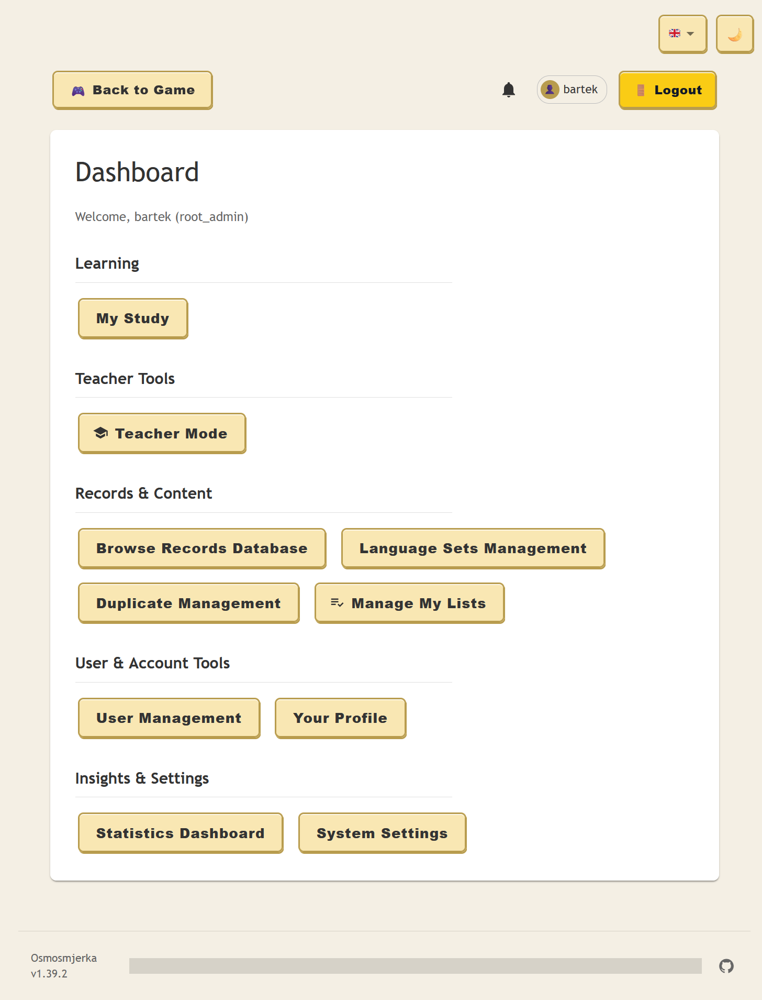

### User Roles

- **Root Administrator** - Full system access, user management, system settings
- **Administrative Users** - Database management, no user creation/deletion
- **Teachers** - Create puzzles, assignments, and study groups for students (Teacher Tools)
- **Regular Users** - Game access only

### Features Overview

#### Phrase Database Management

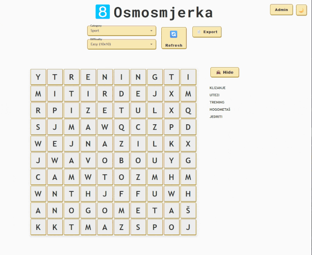

- **Browse & Search** - Advanced filtering, pagination, and search across phrases/translations
- **Inline Editing** - Edit phrases, translations, and categories directly
- **Batch Operations** - Multi-select for bulk delete and category management
- **File Import** - Support for TXT and CSV formats for uploading phrases into the database
- **Copy-Paste Modal** - Quick phrase addition by pasting blocks of text directly (no files needed)
- **Download** - Download the entire database or just filtered rows as a TXT file
- **Duplicate Detection** - Automatic identification and merging of duplicate entries
- **Data Validation** - Real-time validation with clear error reporting

#### User Management

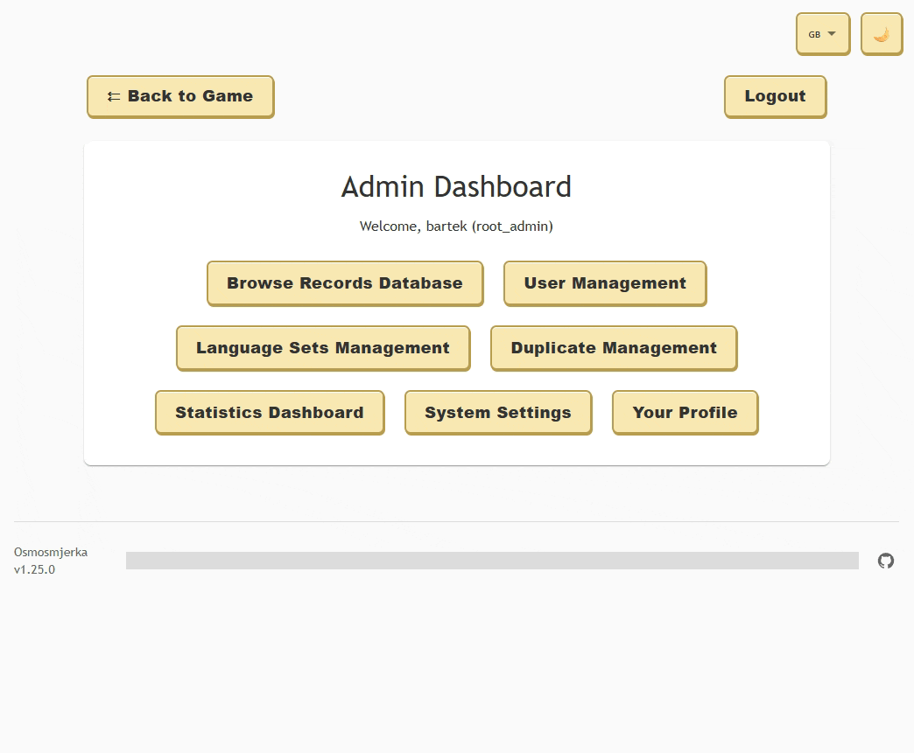

*Available to root administrators only*

- Create and manage user accounts
- Role assignment and permissions
- Password reset functionality
- User profile customization

#### Language Sets Management


Organize phrases into separate collections for different language pairs or themes:

- Create multiple language collections (e.g., Croatian-English, Spanish-French)
- Set default ignored categories per language set
- Bulk operations for moving phrases between sets
- Configure default language set for new users
- Export/import entire language sets

#### System Settings

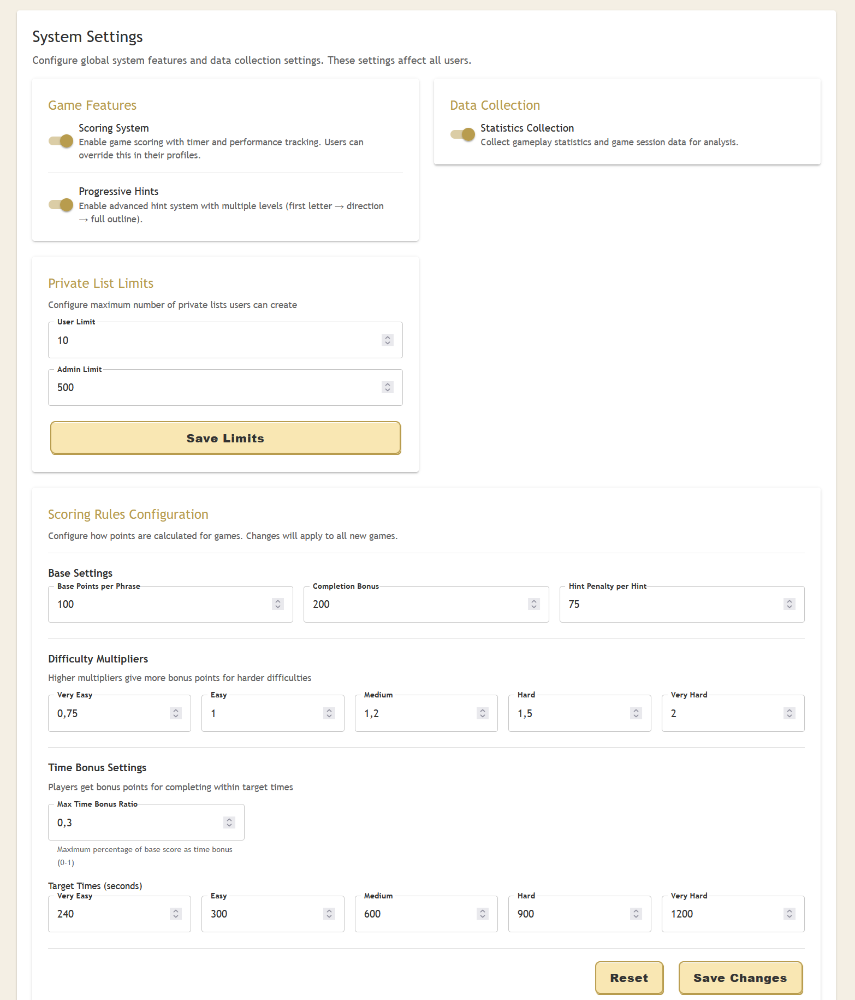

*Root administrators only*

Global configuration for game features:
- **Progressive Hints** - Enable/disable multi-level hint system
- **Statistics Collection** - Toggle gameplay statistics and game session data collection
- **User Overrides** - Allow individual users to override global settings

### Game Features

#### Progressive Hints

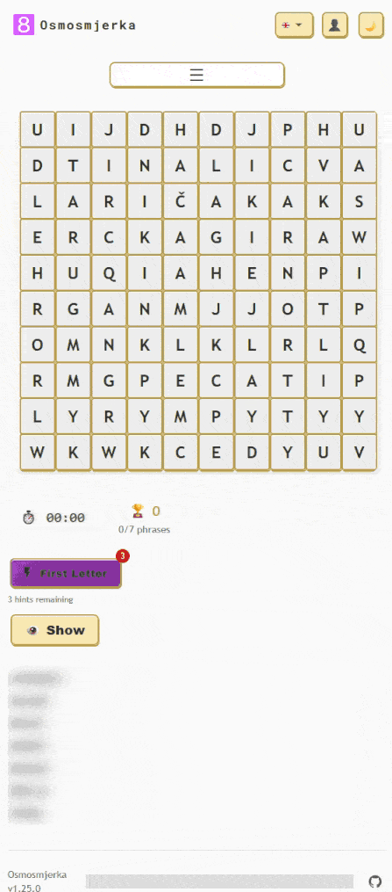

A multi-level assistance system that helps players solve challenging puzzles:
- First letter hints reveal starting characters
- Progressive disclosure maintains challenge balance
- Configurable globally or per-user
- Visual feedback in the grid

#### Mastery & Streak Leaderboard

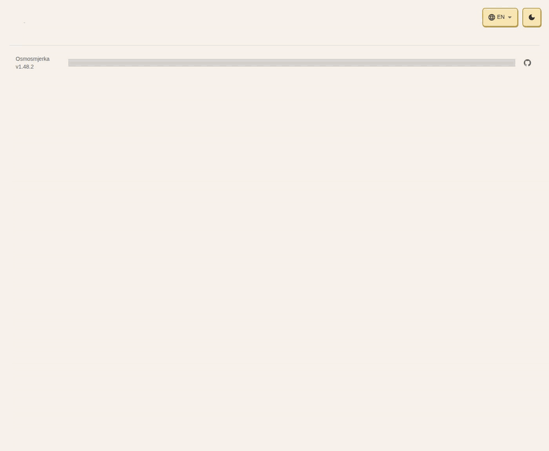

Track and analyze player learning progress:
- Per-word mastery leaderboard, ranked by phrases mastered and current streak
- Completion time and accuracy metrics
- Hint usage patterns
- Category-specific performance
- Game completion rates across difficulty levels

## 🍎 Education & Teacher Mode

Osmosmjerka includes powerful tools for educators to manage classes, create custom assignments, and track student progress.

### For Teachers

*Accessed via the "Teacher Tools" section in the Dashboard.*

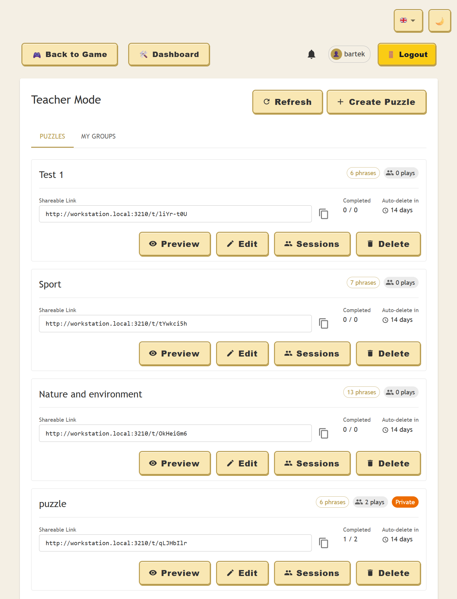
_Manage your puzzles, assignments, and class groups in one place_

*   **Custom Puzzle Creation**: Design puzzles tailored to your lesson plan.
    *   **Content Control**: Select specific phrases from your database or entire language categories.
    *   **Game Rules**: Configure difficulty, toggle hints, enable/disable translations, and set timers.
    *   **Auto-Expiration**: Set assignments to automatically expire after a set number of days.

*   **Class Management**: Organize your students using **Study Groups**.
    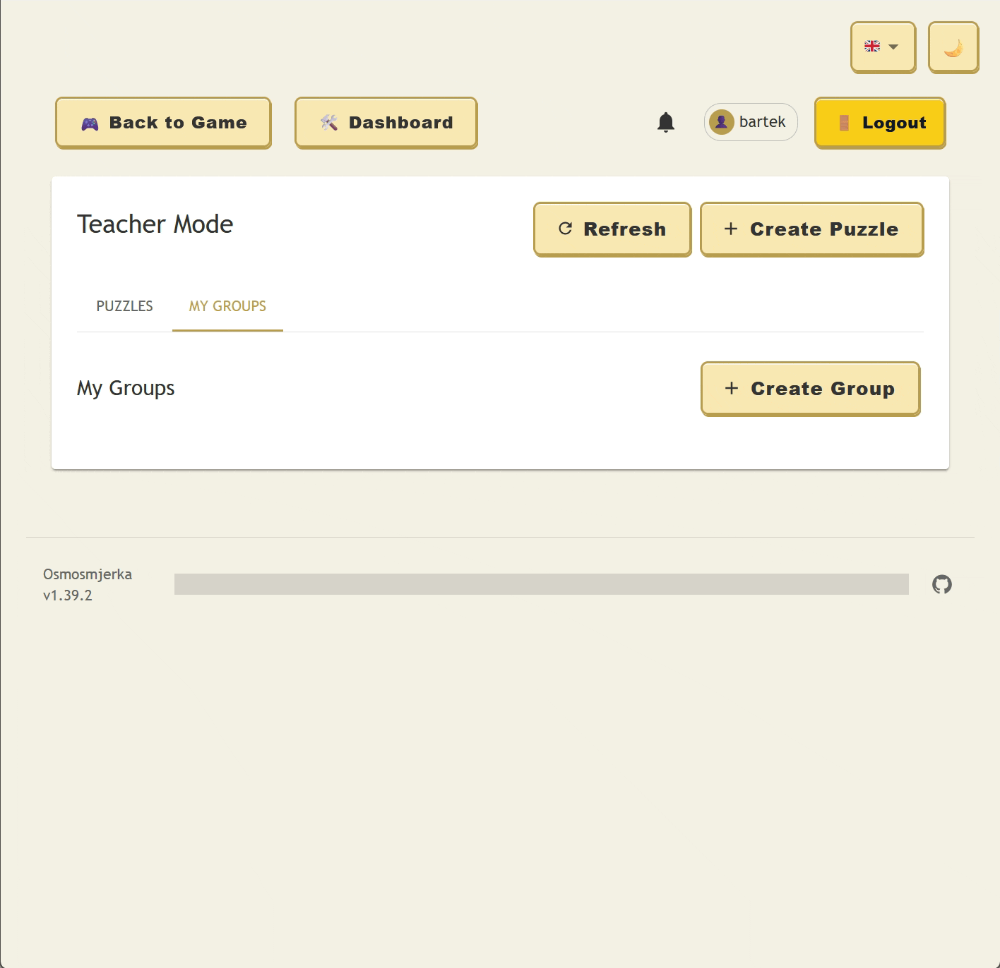
    *   **Simple Onboarding**: Create a group and notify students about it. Students are added to your class roster upon acceptance right from their personal dashboard.
    *   **Bulk Assignments**: Assign a puzzle to an entire group with a single click.

*   **Flexible Assignment Options**:
    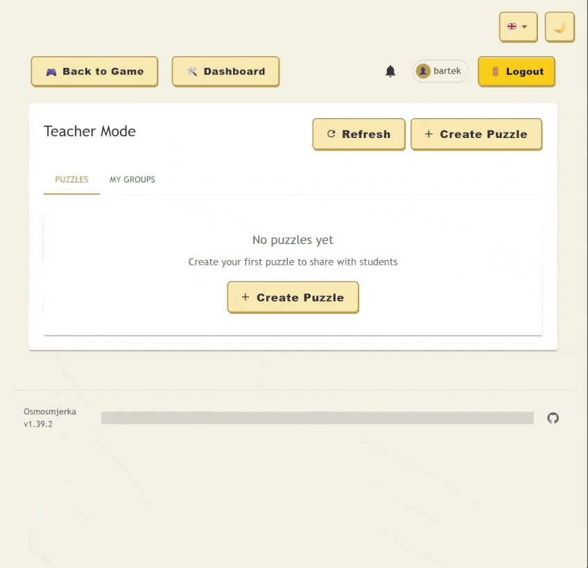
    *   **Public Links**: Generate a shareable link that anyone can play without logging in.
    *   **Private Assignments**: Assign puzzles directly to specific students or groups. These appear securely in their personal dashboard.

*   **Progress Tracking**:
    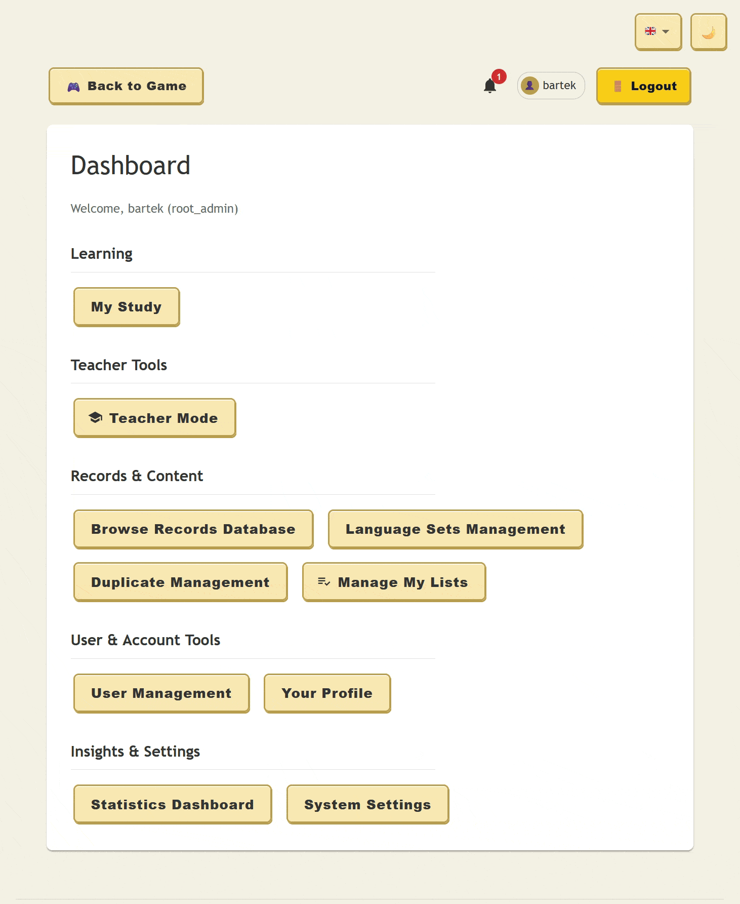
    *   **Session Monitoring**: View detailed reports on who played your puzzles, found phrases, and completion times.
    *   **Review Translations**: Teachers can check student translation inputs if manual entry was required.
    *   **Data Export**: Download session data as CSV files for grading and analysis.

### For Students

*Accessed via the "Learning" section in the Dashboard.*

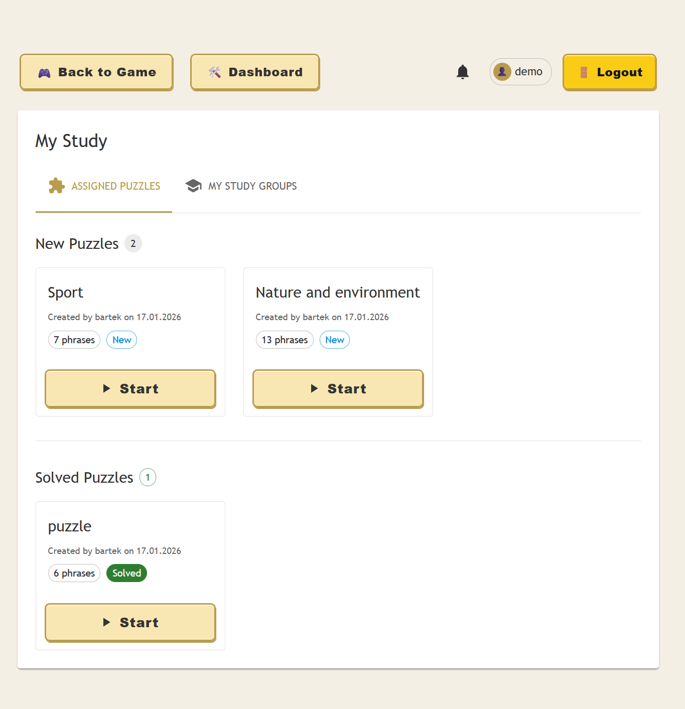
_A clear, organized view of all assigned work_

*   **"My Study" Dashboard**: A dedicated space for all teacher-assigned activities.
    *   **To-Do List**: Assignments are clearly organized into **"New Puzzles"** (Pending) and **"Solved Puzzles"** (Completed).
    *   **Status Indicators**: "New" and "Solved" chips help students prioritize their work.
    *   **Assignment Details**: View the creator's name and assignment date for each puzzle.

* **Study Group Management**: Students review and manage their study groups.
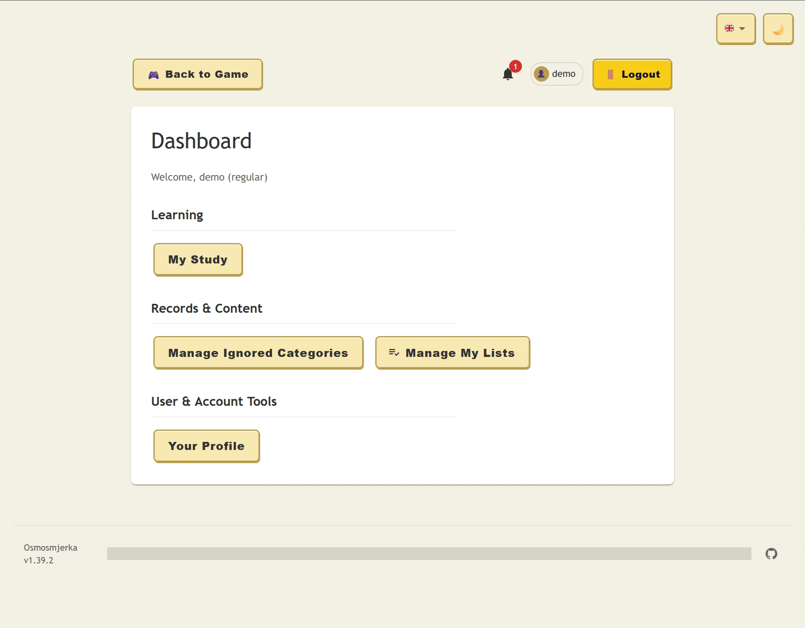

*   **Integrated Learning**: Puzzles assigned by teachers behave just like standard games but the teachers can track progress specific to the assignment and review student's translation inputs.


## 🔒 HTTPS Support

The API server ([uvicorn](https://www.uvicorn.org/)) supports SSL/TLS for secure connections.

### Using SSL Certificates

Store certificates in the `backend` directory and update the Docker `CMD`:

```bash
CMD ["uvicorn", "app:app", "--host", "0.0.0.0", "--port", "443", 
     "--ssl-keyfile=privkey.pem", "--ssl-certfile=fullchain.pem"]
```

### Generate Self-Signed Certificate (Development)

```bash
openssl req -x509 -nodes -days 365 -newkey rsa:2048 \
  -keyout privkey.pem -out fullchain.pem -subj "/CN=localhost"
```

**Note:** Self-signed certificates will trigger browser warnings. For production, use certificates from [Let's Encrypt](https://letsencrypt.org/).

## 🤝 Contributing

Contributions are welcome! Please check out:
- [DEVELOPMENT.md](DEVELOPMENT.md) - Development setup and workflows
- [ALGORITHM.md](ALGORITHM.md) - Grid generation algorithm details

### Adding New Languages

1. Create a new JSON file in `frontend/src/locales/`
2. Translate all entries based on existing language files
3. Register the language in `frontend/src/i18n.js`

## 🗺️ Roadmap

- [x] Spaced-repetition learning modes with per-word mastery tracking
- [ ] Integration with [Anki](https://apps.ankiweb.net/) for spaced repetition learning
- [ ] Learning curve tracking
- [x] Crossword puzzles - clue-based production mode
- [x] Teacher mode - puzzles generated by the teacher to their students
- [x] My Study - play puzzles assigned by teachers, manage your study groups
- [x] Notifications - get notified of new assignments and other events


## 📄 License

Licensed under [Apache License 2.0](LICENSE)

## 🙏 Acknowledgments

- Word search puzzle concept: Traditional [Osmosmjerka](https://hr.wikipedia.org/wiki/Osmosmjerka)
- Example Croatian-Polish phrase database included in `example/` folder

---

<div align="center">
  <p>Made with ❤️ for language learners</p>
  <p>
    <a href="https://github.com/bartekmp/osmosmjerka/issues">Report Bug</a> •
    <a href="https://github.com/bartekmp/osmosmjerka/issues">Request Feature</a>
  </p>
</div>
