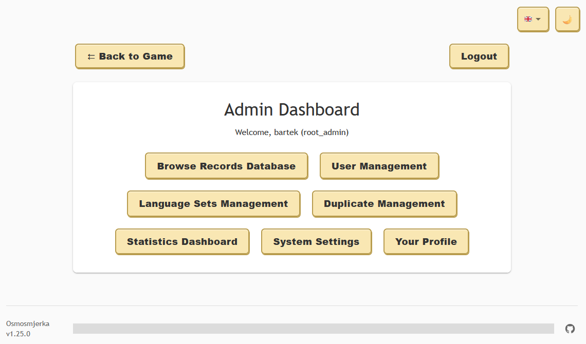

# osmosmjerka
[Osmosmjerka](https://hr.wikipedia.org/wiki/Osmosmjerka) (*Croatian word for eight-direction word search puzzle*) is a feature-rich web-based [word search](https://en.wikipedia.org/wiki/Word_search) game with language learning capabilities.
It uses words from the internal database, which are divided into separate categories, so each puzzle has a certain theme.
Each word includes translation into another language, making it an excellent tool for [flashcard](https://en.wikipedia.org/wiki/Flashcard)-style language training.

**Key Features:**
- **Dark/Light Mode**: Toggle between themes for comfortable viewing
- **Responsive Design**: Optimized for mobile, tablet, and desktop
- **Game State Persistence**: Automatic progress saving and restoration
- **Administrative Tools**: Comprehensive database management with import/export
- **Touch & Mouse Support**: Seamless interaction across all devices


## How it works
Osmosmjerka consists of three layers - a frontend app in [React](https://react.dev/), a [FastAPI](https://fastapi.tiangolo.com/)-based HTTP server and a [SQLite](https://sqlite.org/) database.
The web app communicates with the server, which pulls data from the database and returns it via HTTP requests to the frontend.
The database consists of a single table called `words`, with three columns: `categories`, `word`, and `translation`.
You can provide your own sets of words either by inserting them directly to the database (under `db/words.db` path) or using the *Upload Words* functionality on the admin page. The supported file formats are `.txt` and `.csv`, with the expected format: `<categories>;<word>;<translation>`.
Words should have at least 3 characters to ensure playability - shorter words are automatically filtered out by the API.

## The game
The player needs to find a words shown on the word list in the displayed grid. The words can be found vertically, horizontally, diagonally and with the reversed order of letters.
The puzzle is generated based on the chosen theme and its size (currently there are four levels of difficulty).


Once the word is found, there's a neat confetti effect displayed and the translation of the word appears on the word list.
When all words are discovered, the game ends and allows to load a new puzzle.


### Key Features

**Dark Mode Support**
Toggle between light and dark themes using the moon/sun button. The dark mode provides a comfortable viewing experience in low-light environments with carefully adjusted colors for all UI elements.


**Game State Persistence**
Your progress is automatically saved and restored when you return to the game. The application remembers your selected category, difficulty, found words, and current puzzle state.

**Interactive Logo**
Click on the Osmosmjerka logo to cycle through different bright colors - a fun easter egg that adds visual variety to the interface.

**Export Functionality**
Export the current puzzle to `.docx` format using the Export button. This allows you to print or share puzzles offline.

**Enhanced Word Finding**
- Click on words in the word list to highlight them briefly in the grid
- Toggle translation visibility with the dedicated button
- Words can be selected in any direction: horizontal, vertical, diagonal, and reversed

**Touch and Mouse Support**
The game works seamlessly on both desktop and mobile devices with optimized touch interactions and responsive design.

## Responsive Design

Osmosmjerka is built with responsive design principles to provide an optimal experience across all device types and screen sizes.
The responsive design ensures that whether you're playing on a smartphone, tablet, or desktop computer, you'll have an engaging and user-friendly experience tailored to your device.
On mobile screens, some interface elements are reduced to minimum, to keep as much space for the playing area as possible.

## The admin page
The admin page can be accessed via the `/admin` endpoint, which displays a login screen. The login credentials, i.e. admin username and password hash must be provided via `.env` file (check the `.env.example` file) or the respective env variables before the application is started.


The admin panel provides comprehensive database management capabilities:

### Data Management
- **View and Browse**: Display all existing entries with pagination support and category filtering
- **Inline Editing**: Edit entries directly in the table view with immediate validation
- **Bulk Operations**: Add new entries or delete existing ones with confirmation dialogs
- **Database Clearing**: Remove all entries with a safety confirmation prompt

### File Operations
- **Data Import**: Upload new entries from `.txt` and `.csv` files using the format: `<word>;<translation>;<categories>`
- **Data Export**: Export filtered or complete datasets to `.txt` format for backup or external use
- **Duplicate Prevention**: The system automatically prevents duplicate entries based on the word field

### Advanced Features
- **Category Filtering**: Filter the view by specific categories to manage subsets of data
- **Pagination Controls**: Navigate through large datasets with customizable page sizes
- **Responsive Interface**: The admin panel adapts to different screen sizes with optimized layouts for mobile use
- **Search and Navigation**: Quick offset jumping and intuitive pagination controls



The admin interface supports multiple categories per word (separated by spaces), making it easy to organize vocabulary by themes like "Toys Sport Nouns". The word field serves as the primary key, ensuring data integrity by preventing duplicates during imports.

### How to generate admin's password hash
Use this one-liner to convert your password into a hash, which then you can use to log into admin's page:
```bash
python3 -c "import bcrypt; import getpass; pwd=getpass.getpass('Password: ').encode(); print(bcrypt.hashpw(pwd, bcrypt.gensalt()).decode())"
```

## How to run
1. Pull the code and enter the main directory.
2. Create the `.env` file from the template:
```bash
cp .env.example .env
```
3. Set the variables in the `.env` file. 
The `ADMIN_` variables are used as the credentials to the administrator's page (the hash must be made with [bcrypt](https://github.com/pyca/bcrypt) `hashpw` and the secret is any string of your choice).
The ignored categories allows you to filter out entries of certain categories from your database you don't want to be used in the game.
1. Create the `db` directory, for the purpose of mounting it to the container.
2. Build the Docker image using:
```bash
docker build -t osmosmjerka --build-arg VERSION=v1.0.0 .
```
1. Start the app, exposing the `8085` port and mounting the `db` directory:
```bash
docker run --rm -d -p 8085:8085 --name osmosmjerka -v ./db/:/app/db/ osmosmjerka
```
1. Access the app in your browser at `http://<the host ip>:8085`.

## Example words database
You might use my Croatian-Polish word database as an example placed in the `example` folder.

## HTTPS
The API server ([`uvicorn`](https://www.uvicorn.org/)) supports SSL. If you're not using Nginx or other tech, you might continue using `uvicorn` with HTTPS, making use of self-signed certificate or issued by [Let's Encrypt](https://letsencrypt.org/). 
Store them in the `backend` directory and update your command-line:
```bash
uvicorn your_module:app --host 0.0.0.0 --port 443 --ssl-keyfile=<your private key.pem> --ssl-certfile=<your cert chain file.pem>
```
or the `Dockerfile` entrypoint:
```bash
CMD ["uvicorn", "app:app", "--host", "0.0.0.0", "--port", "443", "--ssl-keyfile=<your private key.pem>", "--ssl-certfile=<your cert chain file.pem>"]
```

Now Osmosmjerka is available on `https://<the host ip>`.

### How to generate a self-signed certificate
Use the `openssl` command to create both key and certificate chain files:
```bash
openssl req -x509 -nodes -days 365 -newkey rsa:2048 -keyout privkey.pem -out fullchain.pem -subj "/CN=localhost"
```
As this is self-signed, the browser will show you dreadful warnings when accessing the app.

## Planned features and fixes
- Multi-language support for the interface
- Enhanced visual effects and animations
- Integration with [Anki](https://apps.ankiweb.net/) for vocabulary learning
- Move to PostgreSQL for better performance and scaling
- API optimization and potential load balancing
- Additional export formats (PDF, image)
- Code quality improvements and testing coverage

# License
Osmosmjerka is licensed under Apache License 2.0.