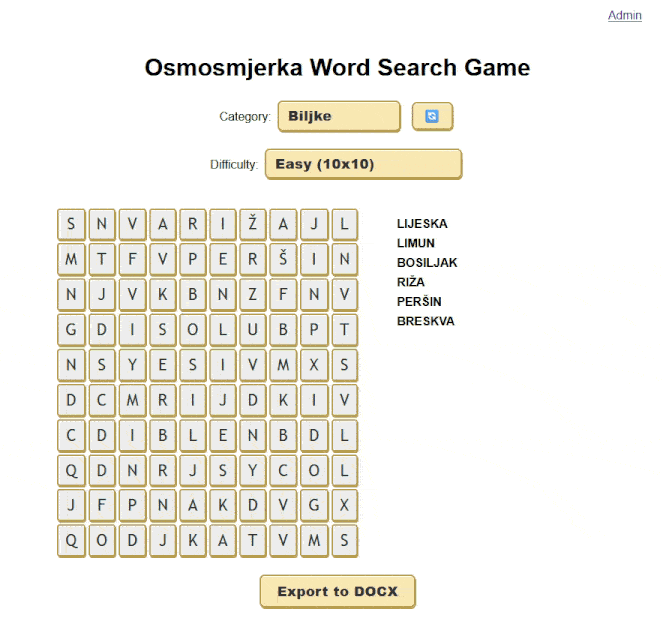

# osmosmjerka
[Osmosmjerka](https://hr.wikipedia.org/wiki/Osmosmjerka) (*Croatian word for eight-direction word search puzzle*) is a simple web-based [word search](https://en.wikipedia.org/wiki/Word_search) game, with a little twist.
It uses words from the internal database, which are divided into separate categories, so each puzzle is having a certain theme.
Each word has to have the translation into the other language, so you can treat the game as something similar to [flashcard](https://en.wikipedia.org/wiki/Flashcard) language training.



## How it works
Osmosmjerka consists of three layers - a frontend app in [React](https://react.dev/), a [Flask](https://flask.palletsprojects.com/en/stable/)-based HTTP server and a [SQLite](https://sqlite.org/) database.
The web app communicates with the server, which pulls data from the database and returns it via HTTP requests to the frontend.
The database so far is expected to have a single table called `words`, which consists of three self-explaining columns `categories`, `word` and `translation`.
You need to provide your own sets of words, either by inserting them directly to the database (under `db/words.db` path) or use the *Upload Words* functionality on the admin page. The supported file formats are `.txt` and `.csv`, and the expected single-line format is `<categories>;<word>;<translation>`.
The words should have at least 3 characters, since less is going to make the hell of a game to find in a grid, however, the API will filter them out automatically.

## The game
The player needs to find a words shown on the word list in the displayed grid. The words can be found vertically, horizontally, diagonally and with the reversed order of letters.
The puzzle is generated based on the chosen theme and its size (currently there are four levels of difficulty).


Once the word is found, there's a neat confetti effect displayed and the translation of the word appears on the word list.
When all words are discovered, the game ends and allows to load a new puzzle.


You may also wish to export the current puzzle to `.docx` format and download it for whatever reason using `Export to DOCX` button.

## The admin page
The admin page can be accessed via the `/admin` endpoint, which displays a login screen. The login credentials, i.e. admin username and password hash must be provided via `.env` file (check the `.env.example` file) or the respective env variables before the application is started.


It allows the administrator to display all existing entries from the database (with pagination), as well as filtering them by category, adding new or editing existing rows to the database, and clearing the entire database (because why not). It also allows to upload new entries to the database from `.txt` and `.csv` files, following this format and order: `<word>;<translation>;<categories>`, where multiple categories are just separated with spaces, e.g. `pelota;ball;Toys Sport Nouns`. The `word` field is used to determine if there are duplicates in the database, and if the backend finds that there's already such a word, it is ignored and not added.


## How to run
1. Pull the code and enter the main directory.
2. Create the `.env` file from the template:
```bash
cp .env.example .env
```
3. Set the variables in the `.env` file. 
The `ADMIN_` variables are used as the credentials to the administrator's page (the hash must be made with [bcrypt](https://github.com/pyca/bcrypt) `hashpw` and the secret is any string of your choice).
The ignored categories allows you to filter out entries of certain categories from your database you don't want to be used in the game.
1. Create the `db` directory, for the purpose of mounting it to the container.
2. Build the Docker image using:
```bash
docker build -t osmosmjerka .
```
1. Start the app, exposing the `8085` port and mounting the `db` directory:
```bash
docker run --rm -d -p 8085:8085 --name osmosmjerka -v ./db/:/app/db/ osmosmjerka
```
1. Access the app in your browser at `http://<the host ip>:8085`.

## Example words database
You might use my Croatian-Polish word database as an example placed in the `example` folder.

## HTTPS
The API server ([`uvicorn`](https://www.uvicorn.org/)) supports SSL. If you're not using Nginx or other tech, you might continue using `uvicorn` with HTTPS, making use of self-signed certificate or issued by [Let's Encrypt](https://letsencrypt.org/). 
Store them in the `backend` directory and update your command-line:
```bash
uvicorn your_module:app --host 0.0.0.0 --port 443 --ssl-keyfile=<your private key.pem> --ssl-certfile=<your cert chain file.pem>
```
or the `Dockerfile` entrypoint:
```bash
CMD ["uvicorn", "app:app", "--host", "0.0.0.0", "--port", "443", "--ssl-keyfile=<your private key.pem>", "--ssl-certfile=<your cert chain file.pem>"]
```

Now Osmosmjerka is available on `https://<the host ip>`.

### How to generate a self-signed certificate
Use the `openssl` command to create both key and certificate chain files:
```bash
openssl req -x509 -nodes -days 365 -newkey rsa:2048 -keyout privkey.pem -out fullchain.pem -subj "/CN=localhost"
```
As this is self-signed, the browser will show you dreadful warnings when accessing the app.

## Planned features and fixes
- Fixing obvious bugs (duh, sure)
- Multi-language support
- Robust visual effects and responsiveness across various devices
- Integration with [Anki](https://apps.ankiweb.net/)
- Move to PostgreSQL
- Add loadbalancing to the API (yeah, overkill)
- Code quality improvements

# License
Osmosmjerka is licensed under Apache License 2.0.