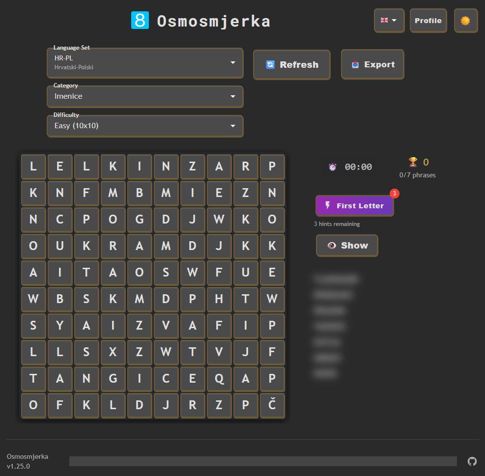
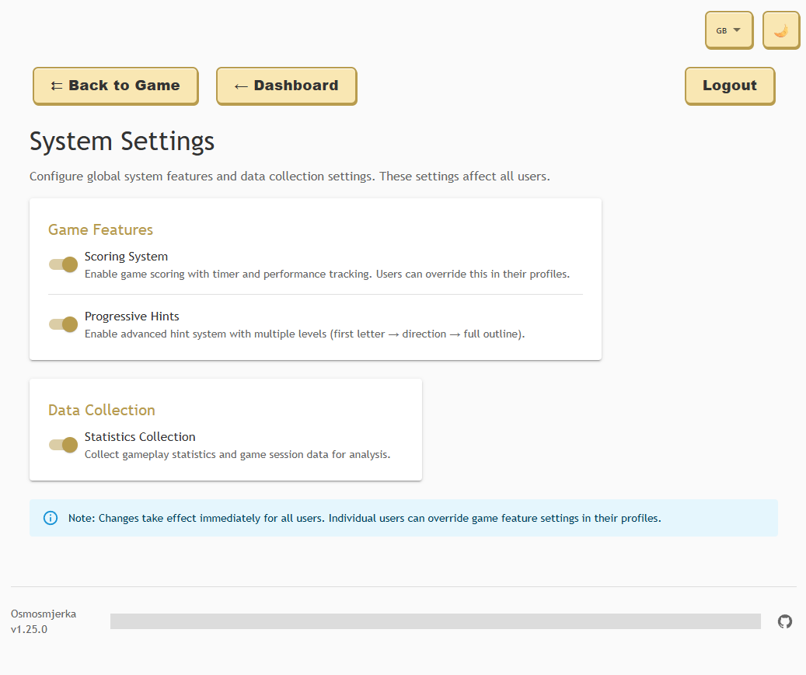

<div align="center">
   <h1 style="font-family: 'Roboto Mono', 'Clear Sans', monospace, sans-serif; font-weight: 700; letter-spacing: 2px; margin: 16px 0;">Osmosmjerka</h1>
  
  **[🎮 Live Demo](https://osmosmjerka.lel.lu/)** - use `demo` login and password
</div>

[Osmosmjerka](https://hr.wikipedia.org/wiki/Osmosmjerka) (*Croatian word for eight-direction word search puzzle*) is a feature-rich web-based [word search](https://en.wikipedia.org/wiki/Word_search) game with language learning capabilities.
It uses phrases from the internal database, which are divided into separate categories, so each puzzle has a certain theme.
Each phrase includes translation into another language, making it an excellent tool for [flashcard](https://en.wikipedia.org/wiki/Flashcard)-style language training.

**Key Features:**
- **Multi-language Interface**: Complete i18n support with English, Croatian, and Polish translations, easily extendible
- **Dark/Light Mode**: Toggle between themes for comfortable viewing
- **Responsive Design**: Optimized for mobile, tablet, and desktop
- **Game State Persistence**: Automatic progress saving and restoration
- **Administrative Tools**: Comprehensive database management with import/export and batch operations
- **Touch & Mouse Support**: Seamless interaction across all devices
- **User Management System**: Role-based access control with root admin capabilities
- **Language Set Management**: Organize phrases into separate language collections
- **Batch Operations**: Efficient bulk editing with category management and multi-select actions
- **Optimized Performance**: Smart API loading and reduced server requests for better user experience

## How it works
Osmosmjerka consists of three layers - a frontend app in [React](https://react.dev/), a [Flask](https://flask.palletsprojects.com/en/stable/)-based HTTP server and a [PostgreSQL](https://www.postgresql.org/) database.
The web app communicates with the server, which pulls data from the database and returns it via HTTP requests to the frontend.
The database so far is expected to have a single table called `phrases`, which consists of three self-explaining columns `categories`, `phrase` and `translation`.
You need to provide your own sets of phrases, either by inserting them directly to the database or use the *Upload Phrases* functionality on the admin page. The supported file formats are `.txt` and `.csv`, and the expected single-line format is `<categories>;<phrase>;<translation>`.
The phrases should have at least 3 characters, since less is going to make the hell of a game to find in a grid, however, the API will filter them out automatically.

## The game


The player needs to find phrases shown on the phrase list in the displayed grid. The phrases can be found vertically, horizontally, diagonally and with the reversed order of letters.
The puzzle is generated based on the chosen theme and its size (currently there are four levels of difficulty).

The word search grid generation uses an intelligent algorithm that creates challenging puzzles by maximizing phrase intersections and maintaining directional diversity. For detailed information about the grid generation algorithm, including technical specifications, performance characteristics, and implementation details, see [ALGORITHM.md](ALGORITHM.md).


Once the phrase is found, there's a neat confetti effect displayed and the translation of the phrase appears on the phrase list.
When all phrases are discovered, the game ends and allows to load a new puzzle.


### Key Features

**Multi-language Interface**
The interface now supports multiple languages with complete internationalization (i18n). Switch between English, Croatian, and Polish using the flag-based language selector in the top-right corner. All text, messages, and error notifications are fully translated, providing a native experience for each language.


**Dark Mode Support**
Toggle between light and dark themes using the moon/sun button. The dark mode provides a comfortable viewing experience in low-light environments with carefully adjusted colors for all UI elements, including loading overlays and error messages.



**User Management System**
A comprehensive user management system with role-based access control:
- **Root Administrator**: Full system access with user creation/deletion capabilities
- **Administrative Users**: Database management with restricted system access
- **Regular Users**: Game access only
- User profiles with customizable descriptions and password management
- Authentication with JWT tokens and bcrypt password hashing

**Game State Persistence**
Your progress is automatically saved and restored when you return to the game. The application remembers your selected category, difficulty, found words, and current puzzle state.

**Interactive Logo**
Click on the Osmosmjerka logo to cycle through different bright colors - a fun easter egg that adds visual variety to the interface.

**Export Functionality**
Export the current puzzle to `.docx`, `.pdf` or `.png` format using the Export button. This allows you to print or share puzzles offline.

**Enhanced Phrase Finding**
- Click on phrases in the phrase list to highlight them briefly in the grid
- Toggle translation visibility with the dedicated button
- Phrases can be selected in any direction: horizontal, vertical, diagonal, and reversed

**Touch and Mouse Support**
The game works seamlessly on both desktop and mobile devices with optimized touch interactions and responsive design.

## Game Features


### Progressive Hints System
Osmosmjerka includes an advanced progressive hints system that provides graduated assistance to help players solve challenging puzzles. This feature can be controlled both globally by administrators and individually by each user.

**How Progressive Hints Work:**
- **Multi-level Assistance**: The hint system provides increasingly specific help through multiple levels
- **First Letter Hints**: Initial hints reveal the first letter of hidden phrases in the grid
- **Advanced Hints**: Subsequent hint levels may reveal additional letters or provide more specific guidance
- **Limited Usage**: Players receive a set number of hints per game to maintain challenge balance
- **Visual Feedback**: Hints are highlighted directly in the grid with clear visual indicators

**Configuration Options:**
- **Global Control**: Root administrators can enable or disable progressive hints system-wide through the System Settings panel
- **User Preferences**: Individual users can override the global setting in their User Profile to enable/disable hints for their account specifically
- **Flexible Override**: Users can choose to use the global setting, explicitly enable hints, or explicitly disable hints regardless of the global configuration

### Scoring System
The scoring system adds a competitive element to the word search experience, tracking player performance and providing achievement metrics.


**How Scoring Works:**
- **Performance Tracking**: The system monitors various gameplay metrics including completion time, hint usage, and accuracy
- **Achievement Recognition**: Players earn scores based on their efficiency and skill in solving puzzles
- **Progress Monitoring**: Long-term statistics help players track their improvement over time
- **Comparative Analysis**: Scoring enables comparison between different gameplay sessions and difficulty levels

**Scoring Configuration:**
- **Global Toggle**: Root administrators can enable or disable the scoring system globally through the System Settings
- **User Override**: Similar to progressive hints, users can override the global scoring setting in their personal profile
- **Flexible Control**: The scoring system can be customized per user while maintaining system-wide defaults

**Statistics and Analytics:**
- **Game Completion Rates**: Track how many games are started versus completed
- **Time Performance**: Monitor average completion times across different difficulty levels
- **Hint Usage Patterns**: Analyze how frequently hints are used and at what stages
- **Category Performance**: See which phrase categories are most challenging for users

## Multi-language Support

Osmosmjerka features complete internationalization (i18n) support with currently three language options: English, Polish and Croatian.
Adding the support for new language is very simple - create a new language JSON file in `frontend/src/locales`, translate all entries based on other language files, and use it in [`frontend/src/i18n.js](frontend/src/i18n.js) file.

All of the user facing texts are translated, including error messages and admin interface labels.

## Responsive Design

Osmosmjerka is built with responsive design principles to provide an optimal experience across all device types and screen sizes.
The responsive design ensures that whether you're playing on a smartphone, tablet, or desktop computer, you'll have an engaging and user-friendly experience tailored to your device.
On mobile screens, some interface elements are reduced to minimum, to keep as much space for the playing area as possible.

## The admin page

The admin page can be accessed via the `/admin` endpoint, which displays a login screen. The system supports multiple user roles with different access levels and provides comprehensive database management capabilities.

For detailed information about all admin panel features and capabilities, see the [Admin Panel Features](#admin-panel-features) section below.

### User Roles and Authentication
- **Root Administrator**: Created automatically on first startup, has full system access including user management
- **Administrative Users**: Can manage word database but cannot create/delete other users
- **Regular Users**: Game access only (future feature)

The login credentials for the root admin (username and password hash) must be provided via `.env` file (check the `.env.example` file) or the respective env variables before the application is started. Additional users can be created through the user management interface.

### How to generate admin's password hash
Use this one-liner to convert your password into a hash, which then you can use to log into admin's page:
```bash
python3 -c "import bcrypt; import getpass; pwd=getpass.getpass('Password: ').encode(); print(bcrypt.hashpw(pwd, bcrypt.gensalt()).decode())"
```

## Admin Panel Features


The admin panel provides a comprehensive suite of tools for managing the word search database, user accounts, and system configuration. The interface is designed to be intuitive and efficient, with optimized performance and minimal server requests.

### Dashboard
The main dashboard serves as the central hub for admin activities, providing quick access to all administrative functions:
- **Browse Records**: Access the phrase database management interface
- **User Management**: Create and manage user accounts (root admin and administrative users only)
- **Language Sets Management**: Organize and configure language collections
- **User Profile**: Edit personal account settings and manage ignored categories

### Browse Records (Phrase Database Management)


The core database management interface provides powerful tools for working with phrase collections:

**Data Browsing and Navigation**
- View all entries with advanced pagination controls and customizable page sizes
- Category-based filtering to focus on specific themes or topics
- Smart search functionality across phrases and translations
- Optimized loading with minimal API requests for better performance

**Inline Editing**
- Edit phrases, translations, and categories directly in the table view
- Real-time validation with immediate feedback
- Automatic saving with optimistic updates for responsive interactions

**Batch Operations**
- Multi-select functionality for bulk operations on multiple entries
- Batch delete selected records with confirmation dialogs
- Bulk category operations: add or remove categories from multiple phrases simultaneously
- Efficient processing with progress feedback and error handling

**Advanced Features**
- Language set filtering to work with specific language collections
- Ignored category management for filtering unwanted content
- Responsive design optimized for mobile and tablet use
- Smart pagination with offset jumping and navigation controls

### File Operations
**Data Import**
- Upload new entries from `.txt` and `.csv` files
- Support for the format: `<phrase>;<translation>;<categories>`
- Automatic duplicate prevention based on phrase uniqueness
- Validation and error reporting for malformed entries
- Batch processing with progress indicators

**Data Export**
- Export filtered or complete datasets to `.txt` format
- Choose specific language sets or categories for targeted exports
- Backup functionality for data preservation
- Format preservation for easy re-import

### User Management


Comprehensive user account management system available to root administrators:

**Account Management**
- Create new user accounts with role assignment
- Edit existing user profiles and account information
- Password reset functionality for user assistance
- Account activation and deactivation controls

**Role-based Access Control**
- Root Administrator: Full system access with user management capabilities
- Administrative Users: Database management with restricted system access
- Granular permission system for secure operation

**User Profiles**


- Customizable user descriptions and profile information
- Individual password management and security settings
- Personal ignored category preferences
- Profile viewing and editing for administrative oversight

### Language Sets Management
Advanced organization system for managing multiple language collections:

**Language Set Configuration**


- Create and configure separate language collections
- Set display names and descriptions for each language set
- Define default ignored categories per language set
- Mark language sets as default for new users

**Category Management**
- Configure default ignored categories for each language set
- View and manage available categories across language sets
- Category filtering and organization tools
- Import/export category configurations

**Data Organization**
- Assign phrases to specific language sets
- Bulk operations for moving phrases between language sets
- Language set filtering in all database operations
- Automatic categorization and validation

The admin interface supports multiple categories per phrase (separated by spaces), making it easy to organize vocabulary by themes like "Toys Sport Nouns". The phrase field serves as the primary key, ensuring data integrity by preventing duplicates during imports.

### System Settings



Root administrators have access to system-wide configuration options that control global game behavior and features. These settings affect all users unless individually overridden in user profiles.

**Global Game Features Configuration**
- **Progressive Hints System**: Enable or disable the progressive hints feature system-wide
- **Scoring System**: Control whether the scoring and statistics tracking system is active globally
- **Feature Toggles**: Easily enable or disable major game features for all users

**How Global Settings Work:**
- **System-wide Control**: Root administrators can set default behavior for all users
- **User Overrides**: Individual users can override global settings in their personal profiles
- **Flexible Management**: Allows for gradual feature rollouts and A/B testing scenarios
- **Immediate Effect**: Changes take effect immediately for all new game sessions

**Setting Hierarchy:**
1. **User Preference**: If a user has set a specific preference, it takes priority
2. **Global Setting**: If no user preference is set, the global system setting is used
3. **Default Behavior**: Fallback behavior if neither user nor global settings are configured

The System Settings panel provides an intuitive interface for managing these configurations, with clear descriptions of each setting's impact and current status indicators.

## Language Sets


Language Sets are an organizational feature that allows you to manage separate collections of phrases for different languages, themes, or learning objectives. This feature transforms Osmosmjerka from a simple word search game into a comprehensive language learning platform.

### What are Language Sets?

A Language Set is a distinct collection of phrases that can be managed independently from other collections. Each Language Set contains its own phrases, categories, and configuration settings. Think of it as creating separate "databases" within your Osmosmjerka instance - for example, you might have one Language Set for Croatian-English learning, another for Spanish-French, and a third for specialized vocabulary like medical terms.

### The Core Idea

The Language Set concept addresses several key needs:

**Multi-language Support**: Organize phrases by language pairs (e.g., Croatian-English, Polish-German, Spanish-Italian) without mixing vocabularies from different language combinations.

**Thematic Organization**: Create focused collections for specific learning goals - business vocabulary, travel phrases, academic terms, or children's vocabulary.

**User Customization**: Different users can work with different Language Sets based on their learning needs, while administrators can maintain separate content collections.

**Content Isolation**: Keep experimental or specialized content separate from your main phrase collections, allowing for safe testing and development.

### Impact on the Game

Language Sets fundamentally enhance the gaming experience by providing:

**Targeted Learning**: Players can focus on specific vocabulary sets relevant to their current learning objectives, making study sessions more efficient and goal-oriented.

**Difficulty Scaling**: Different Language Sets can contain phrases of varying complexity, allowing learners to progress from beginner to advanced levels within the same application.

**Context-Aware Puzzles**: By selecting appropriate Language Sets, players ensure that puzzle themes remain consistent and educationally coherent.

**Personalized Experience**: Users can ignore categories they're not interested in within each Language Set, creating a truly personalized learning environment.

### Creating and Managing Language Sets

#### Creating a New Language Set

1. **Access Language Sets Management**: Navigate to the admin panel and click on "Language Sets Management"
2. **Create New Set**: Use the "Create New Language Set" function to establish a new collection
3. **Configure Basic Settings**: Set the display name, description, and initial configuration for your new Language Set
4. **Define Categories**: Establish the category structure that will be used within this Language Set

#### Loading Records into a Language Set

1. **File Preparation**: Prepare your phrase files in the supported format: `<phrase>;<translation>;<categories>`
2. **Select Target Language Set**: In the admin panel, ensure you have the correct Language Set selected before importing
3. **Upload Process**: Use the "Upload Phrases" functionality to import your data into the selected Language Set
4. **Validation**: The system automatically validates entries, filters duplicates, and ensures data integrity

#### Setting Default Ignored Categories

1. **Access Language Set Configuration**: Open the Language Sets Management interface
2. **Select Language Set**: Choose the Language Set you want to configure
3. **Category Management**: Access the category configuration for the selected set
4. **Define Ignored Categories**: Set which categories should be ignored by default for new users of this Language Set
5. **Save Configuration**: Apply the settings to make them effective for future users

#### Making a Language Set Default

1. **Language Set Selection**: In the Language Sets Management interface, locate your desired Language Set
2. **Default Configuration**: Use the "Set as Default" option to make this Language Set the default choice for new users
3. **User Impact**: New users will automatically start with this Language Set, while existing users can switch manually
4. **System Behavior**: The default Language Set determines which phrases are used when no specific Language Set is selected

### Advanced Language Set Features

**Bulk Operations**: Move phrases between Language Sets using batch operations for efficient content organization.

**Export/Import**: Export entire Language Sets for backup or sharing, and import complete Language Set configurations.

**Category Synchronization**: Maintain consistent category structures across multiple Language Sets while allowing for set-specific customizations.

**User Assignment**: Configure which users have access to specific Language Sets for controlled content distribution.

**Performance Optimization**: Language Sets are loaded efficiently with smart caching and minimal API requests, ensuring responsive user experience even with large vocabulary collections.

The Language Set feature transforms Osmosmjerka into a flexible, scalable platform that can accommodate diverse learning needs while maintaining the engaging word search gameplay that makes vocabulary acquisition enjoyable and effective.

## How to run
1. Pull the code and enter the main directory.
2. Create the `.env` file from the template:
```bash
cp .env.example .env
```
3. Set the variables in the `.env` file. 
The `ADMIN_` variables are used as the credentials to the administrator's page (the hash must be made with [bcrypt](https://github.com/pyca/bcrypt) like this: `bcrypt.hashpw(b"YOUR_PASSWORD", bcrypt.gensalt())` and the secret is any raw string of your choice). The ignored categories allows you to filter out entries of certain categories from your database you don't want to be used in the game.
4. Deploy your PostgreSQL in K8s using the [example](/helpers/k8s-postgres.yaml) YAML or use your own existing instance. Create the database and user account, then fill the `POSTGRES_` variables in the `.env` file. The table will be created upon the first connection.
5. Build the Docker image using:
```bash
docker build -t osmosmjerka --build-arg VERSION=v1.0.0 .
```
6. Start the app, exposing the `8085` port:
```bash
docker run --rm -d -p 8085:8085 --name osmosmjerka osmosmjerka
```
7. Access the app in your browser at `http://<the host ip>:8085`.

## Example phrases database
You might use my Croatian-Polish phrase database as an example placed in the `example` folder. Import it in the admin dashboard using "Upload phrases" button.

## HTTPS
The API server ([`uvicorn`](https://www.uvicorn.org/)) supports SSL. If you're not using Nginx or other tech, you might continue using `uvicorn` with HTTPS, making use of self-signed certificate or issued by [Let's Encrypt](https://letsencrypt.org/). 
Store them in the `backend` directory and update your command-line:
```bash
uvicorn your_module:app --host 0.0.0.0 --port 443 --ssl-keyfile=<your private key.pem> --ssl-certfile=<your cert chain file.pem>
```
or the `Dockerfile` entrypoint:
```bash
CMD ["uvicorn", "app:app", "--host", "0.0.0.0", "--port", "443", "--ssl-keyfile=<your private key.pem>", "--ssl-certfile=<your cert chain file.pem>"]
```

Now Osmosmjerka is available on `https://<the host ip>`.

### How to generate a self-signed certificate
Use the `openssl` command to create both key and certificate chain files:
```bash
openssl req -x509 -nodes -days 365 -newkey rsa:2048 -keyout privkey.pem -out fullchain.pem -subj "/CN=localhost"
```
As this is self-signed, the browser will show you dreadful warnings when accessing the app.

## Planned features and fixes
- Integration with [Anki](https://apps.ankiweb.net/)
- API optimization and potential load balancing

# License
Osmosmjerka is licensed under Apache License 2.0.